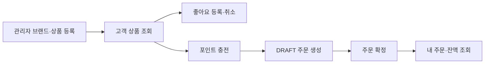

# 요구사항

고객은 상품을 탐색하고 포인트로 주문한다. 관리자는 브랜드·상품·재고를 관리하고 주문을 조회한다.
세부 판단 기준은 [정책](02-business-policies.md), HTTP 계약은 [Use Case](05-use-cases.md)를 따른다.

## 기능과 완료 조건

아래 기능은 첨부 과제를 바탕으로 조정한 학습 범위다.
원문의 인증·인가·본인 여부 검사는 제외하고 사용자별 데이터는 명시적인 ID 입력으로 다룬다.

| ID | 사용자 | 기능 | 정상 결과 / 완료 조건 |
|---|---|---|---|
| R01 | 고객 | 브랜드 상세 | 존재하며 삭제되지 않은 브랜드 정보 반환 |
| R02 | 고객 | 상품 목록·상세 | 브랜드 정보·좋아요 수 포함, 삭제 상품 제외 |
| R03 | 고객 | 상품 조건 조회 | 브랜드 필터, 페이지, 최신·가격·좋아요 정렬 적용 |
| R04 | 고객 | 좋아요 등록·취소 | 사용자–상품 관계 저장·제거, 중복 관계 없음 |
| R05 | 고객 | 내 좋아요 목록 | 경로 userId의 관계 조회, 삭제 상품 제외 |
| R06 | 고객 | 포인트 충전·조회 | 충전 후 저장된 잔액 반환, 1포인트 = 1원 |
| R07 | 고객 | 주문 생성 | 여러 품목의 수량·단가·합계를 DRAFT로 저장, 차감 없음 |
| R08 | 고객 | 주문 확정 | 지정한 DRAFT에서 재고·주문 사용자 포인트 차감, 결제 결과 저장 |
| R09 | 고객 | 내 주문 목록·상세 | 목록은 헤더 userId, 상세는 orderId로 품목·수량·금액·상태·결제액 조회 |
| R10 | 관리자 | 브랜드 CRUD | 유효한 정보 저장·조회·수정, 활성 상품이 있으면 삭제 거절 |
| R11 | 관리자 | 상품 CRUD | 활성 브랜드 참조, 수정 시 브랜드 유지 |
| R12 | 관리자 | 재고 변경 | 0 이상인 최종 수량으로 설정 |
| R13 | 관리자 | 주문 목록·상세 | 구매자를 구분하여 품목·상태·금액·결제 결과 조회 |
| R14 | 공통 | 학습용 사용자 입력 | 필요한 API의 헤더 입력 검증·사용자 존재 확인, 인증·인가는 제외 |

## 대표 사용자 흐름

## 반드시 지킬 결과

| 상황 | 기대 결과 |
|---|---|
| 상품 정보를 수정한 뒤 고객이 조회 | 변경된 현재 정보가 보임 |
| 상품 가격을 수정한 뒤 기존 주문 조회 | 주문 생성 당시 단가·상품명·합계 유지 |
| 재고 5개에서 6개 차감 | 실패, 재고는 5개 |
| 재고 5개에서 2개 차감 | 성공, 재고는 3개 |
| 잔액 0원 → 10,000원 충전 → 7,000원 결제 | CONFIRMED, 결제액 7,000원, 잔액 3,000원 |
| 여러 품목 중 하나의 재고가 부족 | 모든 재고·잔액·주문 상태·기록이 요청 전과 같음 |
| 재고 차감 이후 포인트가 부족 | 전체 롤백, DRAFT 유지, 결제·차감 기록 추가 없음 |
| 이미 확정된 주문을 다시 확정 | 409, 추가 차감·기록 없음 |
| 삭제된 상품을 새 주문에 포함 | 404, 주문 생성 없음 |
| 기존 DRAFT의 상품이 삭제된 뒤 확정 | 404, DRAFT·재고·잔액 유지 |
| 좋아요 목록 경로와 헤더의 userId가 다름 | 경로 사용자의 목록 조회, 일치 검사 없음 |
| 좋아요 등록·취소 직후 | 관계·내 목록은 즉시 반영, 숫자·인기순은 다음 DB 집계 후 반영 |
| 좋아요 집계 실패 | 전체 집계 갱신 롤백, 이전 값 유지·로그 후 다음 주기 실행 |
| 주문 확정에 다른 userId 헤더가 전달됨 | 헤더와 무관하게 주문에 저장된 사용자의 포인트 차감 |

## 이번 범위 밖

동시성 구현·검증(잠금·버전 검증·재시도·동시 요청 테스트)은 다음 학습으로 이관한다.
순차 재확정 거절, DB 유일성 제약, 단일 요청의 전체 롤백은 이번 완료 조건으로 유지한다.

주문 취소·환불, 쿠폰·할인, 배송, 외부 결제, 브랜드 검색, 포인트 이력 조회 API는 제외한다.
비동기 이벤트, 별도 조회 DB, 서비스 분리는 요구하지 않는다.
좋아요 수는 단일 API에서 시작 시 1회, 이전 실행 종료 10초 후 DB 재집계한다. 누락 집계는 0이다.
다중 인스턴스 집계 조율·즉시 재시도·Redis는 제외한다. 주기 집계는 PR 02에서 구현한다.
회원가입·인증·인가·Spring Security·ADMIN 역할·CSRF·본인 여부 검사와 관련 401·403 테스트는 제외한다.
실습 사용자는 fixture로 준비하며 X-USER-ID를 사용하는 API에서 누락·형식 오류는 400, 없는 사용자는 404다.
최소 User·두 사용자 fixture는 PR 01, 초기 잔액 0의 Point 연결은 PR 04에서 수행한다.
기존 사용자 잔액을 초기화하지 않는다. 세부 순서는 [PR 단위 개발 계획](development-plan.md)을 따른다.

## 이후 구현의 검증 경계

| 경계 | 확인할 것 |
|---|---|
| domain | 입력 범위, 재고·잔액·주문 상태의 업무 규칙 |
| application | 지정 사용자 데이터 구분, 처리 순서, 전체 롤백 |
| repository | 저장 값·관계·유일성, flush/clear 후 재조회 |
| HTTP | 실제 Controller·application·repository·테스트 DB로 응답과 상태 확인 |
| 관리자용 HTTP | 사용자 헤더 없이 기능 입력·응답·저장 결과 검증 |

대표 규칙은 Red → Green → Refactor로 확인한다.
코드 구현 완료 시 Checkstyle·ArchUnit·모듈 검사를 수행한다. 이번 산출물은 문서다.
