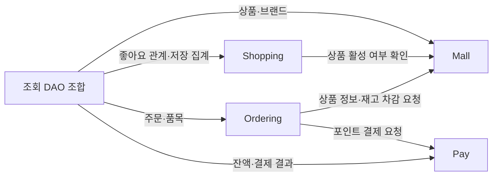

# Domain Space / Bounded Context

Bounded Context는 같은 용어와 규칙을 공유하는 업무 경계다.
이번에는 **네 업무 경계를 단일 서버·DB 안에 둔다.** 별도 서버 네 개를 만드는 의미가 아니다.

## 책임과 소유권

| Context | 책임 | 소유 모델 | 다른 영역에 제공하는 것 |
|---|---|---|---|
| Mall | 브랜드·상품·재고 관리 | Brand, Product | 상품 정보, 활성 여부, 재고 차감 |
| Shopping | 실습 사용자·좋아요 | User, Like | 지정 사용자 ID, 좋아요 관계·집계 자료 |
| Ordering | 주문 생성·확정·조회 | Order, OrderItem | 주문 스냅샷, 합계, 상태 |
| Pay | 포인트 잔액·증감·결제 기록 | Point, PointBill, OrderBill | 잔액, 결제 금액·결과 |

User는 fixture 사용자를 구분하는 최소 모델이다. 인증·인가·본인 여부 검사는 구현하지 않는다.
PR 01에서 User·두 사용자 fixture를 준비하고, PR 04에서 Pay의 초기 잔액 0의 Point를 연결한다.
PR 02는 상품 집계를 위해 Shopping의 Like 관계·집계 저장 구조와 주기 집계를, PR 05는 결제 조회를 위해 Pay의 OrderBill 저장 구조를 먼저 준비한다.
Like 등록·취소와 목록 DAO는 PR 03, 실제 결제 기록 생성은 PR 06에서 연결한다. 선행 구현으로 Context 소유권이 바뀌지는 않는다.
관리자는 별도 업무 Context가 아니라 Mall·Ordering 기능을 사용하는 업무 주체다. 권한 검사는 없다.

## Context Map

화살표는 **정보·기능을 요청하는 방향**이다. HTTP 서버 간 호출을 뜻하지 않는다.

결제 결과는 요청에 대한 반환값으로 Ordering에 전달한다.
Pay가 Ordering의 Entity를 직접 수정하거나 역으로 호출하지 않는다.

## 경계를 넘는 정보

| 요청 | 전달할 정보 | 반환할 정보 |
|---|---|---|
| Shopping → Mall: 좋아요 등록 검증 | productId | 상품 존재·삭제 여부 |
| Ordering → Mall: 주문 생성 | productId 목록 | 상품 ID·상품명·단가·활성 여부 |
| Ordering → Mall: 주문 확정 | productId·합산 quantity 목록 | 차감 성공 또는 오류 |
| Ordering → Pay: 결제 | orderId·userId·주문 합계 | 결제액·PAID 결과 |
| 조회 조합 → 각 데이터 출처 | 검색 조건·지정 사용자 ID | 응답에 필요한 조회 자료 |

다른 Context의 Entity를 자기 Aggregate에 포함하지 않는다.
Like는 productId, OrderItem은 productId와 주문 당시 스냅샷을 보관한다.
Point와 OrderBill은 userId·orderId로 외부 대상을 식별한다.

## 책임을 두는 위치

| 판단·처리 | 담당 |
|---|---|
| HTTP 입력 형식, 헤더 추출, 응답 변환 | interfaces |
| 사용자 존재 확인 | interfaces resolver·좋아요 QueryController → UserQueryDao |
| 상품 재고·포인트 잔액·주문 상태의 유효성 | 해당 Context의 domain |
| 활성 상품 연결 여부를 확인한 브랜드 삭제 조율 | application + Mall의 조회·행동 |
| 브랜드·좋아요 수가 포함된 상품 응답 | infrastructure DAO의 조회 record 조합, interfaces의 ApiResponse 포장 |
| DB 조회·저장, 관계 집계 | infrastructure |

패키지는 계층 → Context → 기능 순서로 나눈다.
예를 들어 `domain.mall.product`, `application.ordering.order`처럼 구성한다.
신규 domain은 순수 Java이며 저장용 JPA 객체는 infrastructure에 둔다.
저장 계약은 domain, QueryDao 계약·조회 결과 타입은 application이 소유한다.
infrastructure는 이 계약을 구현하며 application 구현 서비스에는 의존하지 않는다.
구체적인 이름과 변환 규칙은 [개발 컨벤션](conventions.md), 전체 의존은 [버드뷰](08-birdseye.md)를 따른다.

## 주문 확정의 경계

Ordering의 `ConfirmOrderUseCase`를 구현한 `ConfirmOrderService`가 Mall·Pay의 domain 기능을 조율한다.
각 domain은 자기 상태의 규칙을 지키고, Service의 `execute`가 전체 성공·실패를 하나의 트랜잭션으로 묶는다.
도메인 변경은 repository의 `save`로 명시적으로 저장한다.
따라서 업무 소유권을 분리하면서도 재고만 줄고 결제가 실패하는 저장 상태를 방지한다.

## 그림을 해석하는 기준

원본 그림의 User 근처에 놓인 Point는 Pay가 소유하며 User 내부 Entity로 묶지 않는다.
관리자의 주문 조회도 주문 데이터의 소유권은 Ordering에 있다.
상품 좋아요 수는 Shopping 소유의 주기 집계 테이블에서 읽으며 Product에 중복 상태로 저장하지 않는다.
이벤트 스토밍의 “주문이 확정되었다”는 업무 사실이다. 비동기 이벤트 버스 도입은 별도 결정이다.

모델 경계는 [Domain Model](04-domain-model.md), 실행 순서는 [Use Case](05-use-cases.md)에서 확인한다.
