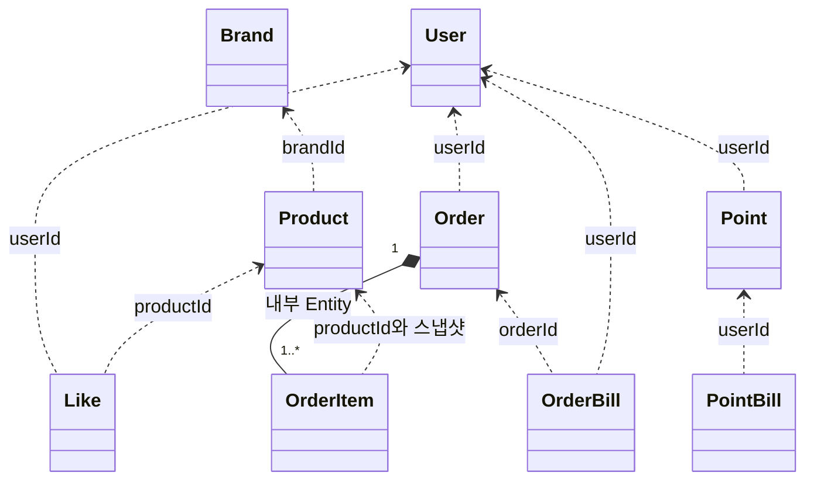
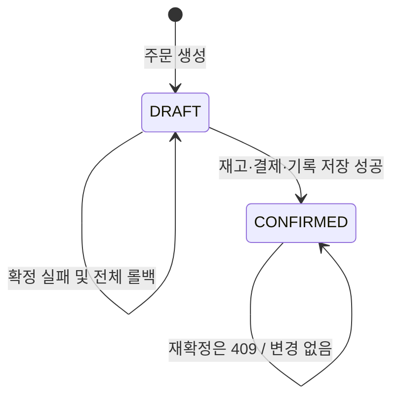

# Aggregate / Domain Model

Aggregate는 함께 지켜야 할 상태·규칙을 묶는 경계이며, Root의 행동으로 변경한다.
**Aggregate 경계와 DB 트랜잭션 범위가 항상 같지는 않다.** 주문 확정은 여러 Aggregate를 함께 저장한다.

신규 모델은 순수 Java로 작성하고 infrastructure의 JPA Entity와 분리한다.
`create`와 `restore` 모두 유효한 상태를 보장하며, 공개 setter 대신 의미 있는 행동으로 변경한다.
Money·Stock 같은 값 객체와 구체적인 이름은 [개발 컨벤션](conventions.md)을 따른다.

## 모델 관계

실선 합성은 Aggregate 내부 포함, 점선은 ID 참조다. JPA 객체 연관을 그대로 요구하는 그림이 아니다.

## 상태와 행동

| 소유 | Root / 모델 | 핵심 상태 | 주요 행동 |
|---|---|---|---|
| Mall | Brand | id, name, description, deleted, createdAt | 생성, 정보 변경, 논리 삭제 |
| Mall | Product | id, brandId, name, description, price, stock, deleted, createdAt | 생성, 정보 변경, 재고 설정·차감, 논리 삭제 |
| Shopping | User | id | fixture로 식별 |
| Shopping | Like | userId, productId, createdAt | 관계 생성·제거 |
| Ordering | Order | id, userId, status, totalAmount, createdAt, items | 생성, 확정 |
| Ordering | OrderItem | productId, productName, unitPrice, quantity, amount | 주문 생성 시 구성 |
| Pay | Point | userId, balance | 충전, 결제 차감 |
| Pay | PointBill | id, userId, orderId, type, amount, balanceAfter, createdAt | 변경 내역 기록 |
| Pay | OrderBill | id, orderId, userId, amount, status, createdAt | 성공 결제 기록 |

OrderItem은 Order 내부 Entity이며 단독 변경 API를 제공하지 않는다.
PointBill·OrderBill은 증가하는 이력을 별도 기록으로 보관하고 생성 후 수정하지 않는다.
PointBill의 amount는 양수이며 CHARGE/USE로 증감 방향을 구분한다. 충전의 orderId는 null이다.
OrderBill은 성공 시에만 생성하며 이번 범위의 상태는 PAID다. DRAFT에는 OrderBill이 없다.

## 불변식과 협력

| 모델 | 스스로 지킬 규칙 | application에서 함께 확인할 것 |
|---|---|---|
| Brand | 유효한 이름·설명, 삭제 후 변경 금지 | 활성 연결 상품이 없는지 |
| Product | 양수 가격, 0 이상 재고, 부족 차감·삭제 후 변경 금지 | 참조 브랜드의 존재·활성 여부 |
| Like | userId·productId의 유효성 | 사용자·상품 확인, 관계 유일성 |
| Order | 품목 한 개 이상, 양수 수량, 합계 일치, DRAFT에서만 확정 | 저장된 사용자 결제 연결, 현재 상품 상태, 재고·결제 결과 |
| Point | 음수 잔액 금지, 양수 충전·차감, 부족·범위 초과 거절 | 사용자와 주문의 연결 |
| PointBill | 양수 amount, 유효한 type·차감 후 잔액 | 실제 잔액 변경과 같은 트랜잭션 |
| OrderBill | 양수 결제액, orderId별 성공 기록 하나 | 주문 합계와 결제액 일치 |

관계·결제의 중복은 DB의 `(userId, productId)`, `orderId` 유일성으로도 보호한다.
주문 상태 검사와 차감은 같은 트랜잭션에서 수행한다. 동시 요청에서도 중복 차감·갱신 유실이 없도록
Order·Product·Point의 잠금 또는 버전 검증을 구현 시 함께 적용해야 한다.

## 주문 상태

CONFIRMED는 결제를 마친 상태다. 취소·환불·결제 대기 상태는 추가하지 않는다.
주문 생성 후 품목 수정 API가 없으며 단가·상품명 스냅샷은 현재 상품 변경과 무관하게 유지한다.

## 저장 경계

| 유스케이스 | 함께 저장하는 상태 |
|---|---|
| 주문 생성 | Order + OrderItem 전체 |
| 포인트 충전 | Point + CHARGE PointBill |
| 주문 확정 | 모든 Product 재고 + Point + USE PointBill + OrderBill + Order 상태 |
| 좋아요 등록·취소 | 헤더로 지정한 사용자의 Like 관계 |

한 품목의 재고 부족이나 결제 실패도 확정 전체를 실패시킨다.
부분 차감 후 보상 데이터를 추가하는 대신 요청 전 상태로 롤백한다.
트랜잭션은 application의 UseCase 구현 Service가 소유하고, 변경된 도메인은 repository의 `save`로 저장한다.
RepositoryImpl은 저장을 조율하고 EntityMapper는 도메인 복원·신규 Entity 변환·기존 Entity 반영을 담당한다.
기존 Entity의 ID·생성 시각·잠금 버전 등은 변환 중 보존한다. domain은 JPA 변경 감지에 의존하지 않는다.

값의 범위는 [정책](02-business-policies.md), 조회 형태는 [Read Model](06-read-models.md)에 정의한다.
