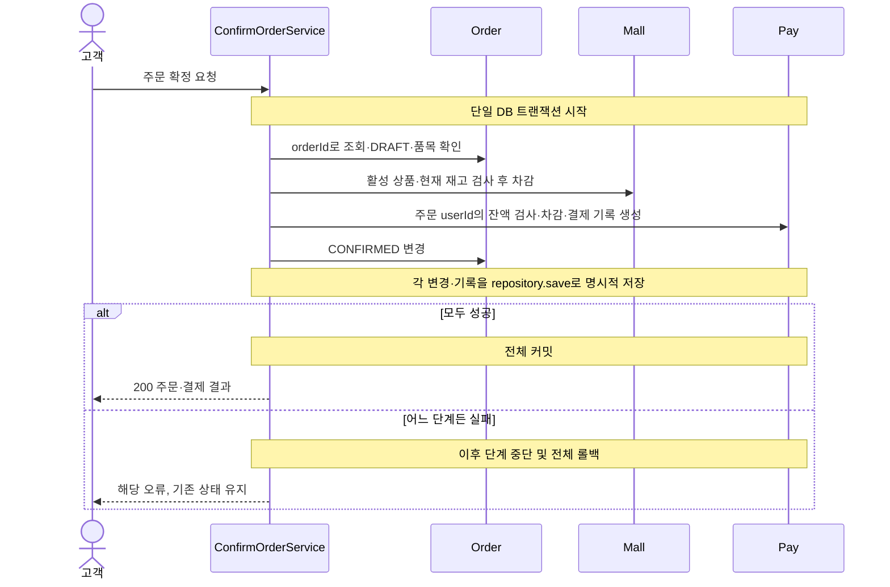

# Use Case / API 계약

모든 성공 응답은 `ApiResponse(meta, data)`다. 표의 성공 값은 HTTP 상태와 data의 내용이다.
응답 모델은 [Read Model](06-read-models.md), 오류 E번호는 [오류 명세](07-error-specification.md)를 참조한다.
X-USER-ID는 학습용 사용자 입력이며 인증·인가를 수행하지 않는다. 필요한 API는 아래 입력 열에 표시한다.
공통 입력 오류는 E01, 필요한 헤더의 누락·형식 오류는 E02(400), 없는 사용자는 E04(404)다.
경로 ID는 양의 정수다. 목록 조건은 page·size이고 상품만 brandId·sort를 추가로 받는다.

각 쓰기 행동은 `ConfirmOrderUseCase` 같은 인터페이스와 `ConfirmOrderService` 같은 구현체로 나눈다.
쓰기 실행 메서드는 execute이며 Service에 트랜잭션을 둔다. GET은 QueryController → QueryDao로 연결한다.
단순 조회는 JdbcClient, 동적 조건·정렬 조합이 많은 상품 조회는 QueryDSL을 사용하고 DAO 구현에 readOnly를 둔다.
쓰기는 Request → Command → Result → Response, 조회는 Criteria → 조회 record → ApiResponse로 전달한다. [명명·변환 규칙](conventions.md)을 따른다.

## 고객 API

아래 경로의 접두사는 `/api/v1`이다. GET·DELETE에는 본문이 없다.

| 기능 | Method / Path | 입력 | 성공 | 대표 오류 |
|---|---|---|---|---|
| 브랜드 상세 | GET /brands/{brandId} | 경로 ID | 200 BrandDetail | E04 |
| 상품 목록 | GET /products | brandId?, sort?, page?, size? | 200 `Page<ProductSummary>` | E01 |
| 상품 상세 | GET /products/{productId} | 경로 ID | 200 ProductDetail | E04 |
| 좋아요 등록 | POST /products/{productId}/likes | X-USER-ID, 경로 ID, 본문 없음 | 200 null | E02, E04 |
| 좋아요 취소 | DELETE /products/{productId}/likes | X-USER-ID, 경로 ID | 200 null | E02, E04 |
| 내 좋아요 | GET /users/{userId}/likes | 경로 ID, page?, size? | 200 `Page<LikeItem>` | E01, E04 |
| 포인트 충전 | POST /points/charge | X-USER-ID, 본문 amount | 200 PointBalance | E01, E02, E04, E09 |
| 내 잔액 | GET /points | X-USER-ID | 200 PointBalance | E02, E04 |
| 주문 생성 | POST /orders | X-USER-ID, 본문 items: [{productId, quantity}] | 201 OrderDetail | E01, E02, E04, E09 |
| 주문 확정 | POST /orders/{orderId}/confirm | 경로 ID, 본문 없음 | 200 OrderDetail | E04, E06, E07, E08 |
| 내 주문 목록 | GET /orders | X-USER-ID, page?, size? | 200 `Page<OrderView>` | E02, E04 |
| 내 주문 상세 | GET /orders/{orderId} | 경로 ID | 200 OrderDetail | E04 |

내 좋아요 목록은 경로 userId를 사용하고 헤더와 비교하지 않는다. 주문 목록은 헤더 userId로 필터링한다.
주문 상세·확정은 orderId로 조회하며 헤더가 필요 없다. 결제 대상은 저장된 주문의 userId다.
상품·브랜드 조회도 헤더가 필요 없다. 헤더를 사용하지 않는 API는 전달된 헤더를 무시한다.
좋아요 취소는 사용자 존재 확인 후 현재 상품 조회 없이 지정 사용자와 productId의 관계만 제거한다.
헤더 사용자 존재는 resolver가 UserQueryDao.findById로 확인한다. 쓰기 Service는 이를 재검사하지 않는다.
좋아요 목록 Controller는 경로 사용자 존재를 같은 DAO로 확인한다. 상세 DAO의 Optional이 비면 Controller가 404로 변환한다.
모든 상품 응답의 likeCount·인기순은 저장된 주기 집계 기준이다. 관계와 내 목록 포함 여부만 즉시 반영한다.

## 관리자 API

접두사는 `/api-admin/v1`이며 기능 구분용 경로다. 사용자 헤더·ADMIN 역할·CSRF 검사를 요구하지 않는다.
과제 원문의 인증·인가 구현은 이번 학습 범위에서 제외한다.

| 기능 | Method / Path | 입력 | 성공 | 대표 오류 |
|---|---|---|---|---|
| 브랜드 목록 | GET /brands | page?, size? | 200 `Page<BrandDetail>` | E01 |
| 브랜드 상세 | GET /brands/{brandId} | 경로 ID | 200 BrandDetail | E04 |
| 브랜드 등록 | POST /brands | name, description? | 201 BrandDetail | E01 |
| 브랜드 수정 | PUT /brands/{brandId} | name, description? | 200 BrandDetail | E01, E04 |
| 브랜드 삭제 | DELETE /brands/{brandId} | 경로 ID | 200 null | E04, E05 |
| 상품 목록 | GET /products | brandId?, sort?, page?, size? | 200 `Page<AdminProduct>` | E01 |
| 상품 상세 | GET /products/{productId} | 경로 ID | 200 AdminProduct | E04 |
| 상품 등록 | POST /products | brandId, name, description?, price, stock | 201 AdminProduct | E01, E04 |
| 상품 수정 | PUT /products/{productId} | name, description?, price | 200 AdminProduct | E01, E04 |
| 상품 삭제 | DELETE /products/{productId} | 경로 ID | 200 null | E04 |
| 재고 설정 | PUT /products/{productId}/stock | stock | 200 AdminProduct | E01, E04 |
| 주문 목록 | GET /orders | page?, size? | 200 `Page<AdminOrderView>` | E01 |
| 주문 상세 | GET /orders/{orderId} | 경로 ID | 200 AdminOrderDetail | E04 |

PUT 정보 수정은 표에 적힌 필드를 교체한다. 선택 설명의 누락·null은 설명 없음으로 저장한다.
상품 수정 입력에 brandId·stock은 포함하지 않으며 브랜드·재고는 정보 수정으로 바뀌지 않는다.
관리자 주문 목록은 전체 구매자의 주문을 조회하고 구매자 ID를 응답에 포함한다.

## 변경 유스케이스

| 유스케이스 | 처리 순서 | 실패 시 |
|---|---|---|
| 브랜드·상품 등록/수정 | 입력·참조·활성 검사 → 생성/변경 → 저장 | 기존 값 유지 |
| 브랜드 삭제 | 활성 브랜드 조회 → 활성 연결 상품 검사 → 논리 삭제 | 연결 상품이 있으면 그대로 유지 |
| 상품 삭제·재고 설정 | 활성 상품 조회 → 행동 규칙 검사 → 저장 | 상품·재고 유지 |
| 좋아요 등록 | resolver 사용자 존재 확인 → 활성 상품 확인 → 관계가 없을 때만 저장 | 관계 변화 없음 |
| 좋아요 취소 | resolver 사용자 존재 확인 → 해당 관계가 있으면 제거 | 관계 없으면 그대로 성공 |
| 포인트 충전 | resolver 사용자 존재 확인 → 금액·합산 범위 검사 → 잔액 증가·CHARGE 기록 | 잔액·기록 유지 |
| 주문 생성 | 입력·resolver 사용자 존재 검사 → 중복 수량 합산 → 활성 상품 조회 → 스냅샷·합계 저장 | 주문·품목 생성 없음 |

## 주문 확정 흐름

실패 분기는 실패가 발생한 지점에 적용한다. 실패 후 나머지 단계를 계속 수행한다는 뜻이 아니다.
확정은 저장된 단가를 사용하며 상품 가격 변경을 반영하지 않는다.
확정 성공 뒤 조회되는 paymentAmount는 totalAmount와 같고 paymentStatus는 PAID다.

## 연결 검증 예

잔액 0원에서 10,000원 충전 → 2,000원 상품 2개와 3,000원 상품 1개 주문 생성 → 확정한다.
생성 직후 잔액은 10,000원이며 재고는 그대로다.
확정 후 잔액은 3,000원, 품목별 재고는 각각 2개·1개 감소하고 결제액은 7,000원이다.
같은 주문을 재확정하면 E08이며 잔액·재고·기록은 더 변하지 않는다.
