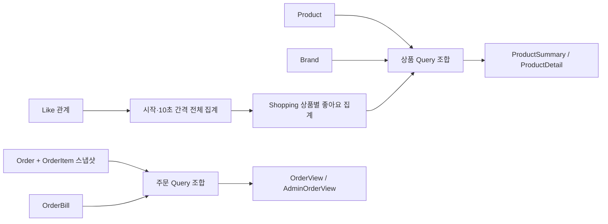

# Read Model / Query

조회 모델은 화면·API에 필요한 값을 모은 결과다. Entity를 그대로 응답하지 않는다.
현재 상품 정보와 주문 생성 당시 정보는 목적이 다르므로 구분한다.

## 응답 모델

필드 이름은 API 계약이다. `?`는 null이 가능한 값이며 금액은 원 단위 정수다.

| 모델 | 응답 필드 |
|---|---|
| BrandDetail | brandId, name, description? |
| BrandSummary | brandId, name |
| ProductSummary | productId, name, price, brand: BrandSummary, likeCount |
| ProductDetail | ProductSummary의 필드 + description?, stock |
| AdminProduct | ProductDetail의 필드 + createdAt |
| LikeItem | ProductSummary의 필드 + likedAt |
| PointBalance | userId, balance |
| OrderItemView | productId, productName, unitPrice, quantity, amount |
| OrderView | orderId, status, totalAmount, paymentAmount?, paymentStatus?, createdAt, items: OrderItemView[] |
| OrderDetail | OrderView와 동일한 필드 |
| AdminOrderView | OrderView의 필드 + userId |
| AdminOrderDetail | AdminOrderView와 동일한 필드 |

주문 목록도 과제에서 요구한 품목·수량·금액·결제 정보를 포함한다.
고객 주문 응답에는 userId 필드가 없고, 관리자 주문 응답에는 구매자를 구분할 userId가 있다.
이는 응답 필드 차이이며 접근 권한을 의미하지 않는다. 인증·인가는 구현하지 않는다.
브랜드는 고객·관리자에 필요한 정보가 같으므로 동일 응답 모델을 사용한다.

## 데이터 출처와 노출 조건

| 조회 | 데이터 출처 | 조건 |
|---|---|---|
| 브랜드 상세·관리자 목록 | Brand | 활성 브랜드만 |
| 상품 목록·상세 | Product + Brand + Shopping의 상품별 좋아요 집계 | 활성 상품·브랜드, 집계 행이 없으면 0 |
| 내 좋아요 목록 | 경로 userId의 Like + Product + Brand + 상품별 좋아요 집계 | 활성 상품만, 지정 사용자로 필터링 |
| 내 잔액 | 헤더 userId의 Point | DB에 저장된 현재 balance |
| 내 주문 목록 | Order + OrderItem + OrderBill | 헤더 userId로 필터링, 상품 삭제 후에도 조회 가능 |
| 내 주문 상세 | Order + OrderItem + OrderBill | orderId로 조회, 헤더·본인 여부 검사 없음 |
| 관리자 주문 목록·상세 | Order + OrderItem + OrderBill | 모든 구매자, userId 포함 |

상품 조회의 이름·가격·브랜드는 현재 값이다.
주문 조회의 productName·unitPrice·amount는 스냅샷이며 현재 Product와 조인해 덮어쓰지 않는다.
결제 기록은 OrderBill에서 조합한다. DRAFT의 paymentAmount·paymentStatus는 null이다.
CONFIRMED는 paymentAmount = totalAmount, paymentStatus = PAID다.

PR 02에서 Like 관계·유일성·상품별 집계 테이블과 주기 집계를 준비하고 관계 fixture로 검증한다.
PR 03에서 등록·취소와 목록 DAO를 연결한다. 관계·목록 포함 여부는 즉시 반영하고 숫자·인기순은 집계 후 반영한다.
집계 테이블은 productId를 유일 키로 하며 likeCount를 저장한다. 상품에 집계 상태를 중복 저장하지 않는다.
단일 commerce-api에서 시작 시 1회, 이전 실행 종료 10초 후 전체 관계 COUNT를 다시 저장한다.
마지막 관계가 취소된 상품도 0으로 갱신한다. 누락된 집계 행은 조회 시 0이며 실시간 COUNT로 대체하지 않는다.
전체 집계 실패 시 트랜잭션을 롤백하고 이전 값 유지·로그 기록 후 다음 주기에 실행한다.
스케줄러는 application 집계 Service를 호출하며 집계 저장 계약은 읽기 DAO와 분리한다.
상품 쓰기 성공 응답도 저장된 집계 값만 DAO로 읽고 기존 Result를 구성한다. 상품 전체를 다시 조회하지 않는다.
PR 05에서 OrderBill 저장·조회 구조를 준비하고 결제 결과 조합은 저장 fixture로 검증한다.
PR 06에서 실제 결제 기록 생성과 확정을 연결한 뒤 기존 주문 조회 API의 결제 결과도 검증한다.

## 조회 조합



모든 GET은 고객·관리자별 QueryController로 분리하고 기존 URL을 유지한다.
QueryController → application의 QueryDao 인터페이스 → infrastructure의 Jdbc 구현체로 연결한다.
조회 UseCase·Service는 두지 않는다. 예: ProductQueryDao / QueryDslProductQueryDao / ProductQueryController.
단순 상세·단일 값 조회와 집계 벌크 쓰기는 Spring JDBC의 JdbcClient를 사용하고,
동적 필터·정렬·페이지 조합이 많은 상품 조회는 QueryDSL을 사용한다. Spring Data JDBC Repository는 사용하지 않는다.
기존 JPA와 같은 DB·DataSource에서 Context 간 조인을 허용하되 테이블 소유권은 유지한다.
DAO는 SQL·조회 모델 조합을 담당하고 공개 조회 메서드에 readOnly 트랜잭션을 둔다.
Controller는 HTTP 입력·404·ApiResponse 포장을 담당한다. 상세 DAO의 Optional이 비면 기존 오류를 발생시킨다.
Criteria·조회 모델·페이지 결과는 application의 순수 Java record이며 HTTP·JPA·Spring Data Page에 의존하지 않는다.
조회 record를 별도 Response 복사 없이 반환하며 위 응답 필드를 유지한다. domain은 이 DTO를 알지 못한다.
domain repository는 쓰기 중 도메인 복원·저장에 집중한다. DAO가 application 구현 Service를 호출하는 것은 금지한다.
UserQueryDao.findById로 resolver와 좋아요 목록 Controller가 사용자 존재를 검사한다.
주문 목록은 주문 페이지·전체 개수·선택된 주문의 품목을 한 DAO 메서드에서 묶어 조회하고 주문별 반복 SQL을 피한다.
저장된 좋아요 집계 값으로 정렬한 뒤 페이지를 자른다. SQL 값은 이름 있는 파라미터로 바인딩한다.

## 정렬·페이지

| 목록 / sort | 1차 정렬 | 동률 정렬 |
|---|---|---|
| 상품 latest (기본) | Product.createdAt DESC | productId DESC |
| 상품 price_asc | price ASC | productId DESC |
| 상품 likes_desc | likeCount DESC | productId DESC |
| 내 좋아요 | Like.createdAt DESC | productId DESC |
| 브랜드 | Brand.createdAt DESC | brandId DESC |
| 주문 | Order.createdAt DESC | orderId DESC |

상품의 brandId는 선택 필터이며 고객·관리자 목록에 같은 규칙을 적용한다.
필터 값이 양의 정수이지만 브랜드가 없거나 삭제되었다면 빈 목록이다.
page는 0부터 시작하고 기본 0, size는 기본 20·최대 100이다. 잘못된 값은 400이다.
동률 보조 정렬은 동일 데이터의 순서를 안정화하지만, 페이지 조회 사이의 데이터 변경까지 고정하지는 않는다.

```json
{
  "meta": { "result": "SUCCESS", "errorCode": null, "message": null },
  "data": { "items": [], "page": 0, "size": 20, "totalElements": 0, "totalPages": 0 }
}
```

totalElements는 필터·삭제·지정 사용자 조건을 적용한 개수다. 좋아요 조인으로 상품이 중복 집계되지 않게 한다.
범위 밖 페이지도 같은 봉투와 빈 items를 반환하며 전체 개수는 실제 필터 결과를 유지한다.
응답 시각은 UTC ISO 8601 문자열로 통일한다. 예: `2026-09-16T07:00:00Z`.

## 검증할 사례

- 미집계 상품도 목록에 나오고 likeCount는 0이다. 마지막 취소 후 집계하면 기존 값도 0이 된다.
- 관계·내 목록은 즉시 반영하고 모든 상품 응답의 숫자·인기순은 다음 집계에서 반영한다.
- 집계 실패 시 기존 값이 보존된다. 집계를 직접 호출해 검증하며 실제 10초를 기다리지 않는다.
- 같은 가격·좋아요 수의 상품은 ID 내림차순이며 페이지 간 중복이 없다(데이터 변경 없는 조건).
- 상품 수정은 현재 조회에 반영되지만 기존 주문의 이름·가격은 변하지 않는다.
- 삭제 상품은 목록·내 좋아요에서 빠지며 과거 주문 품목에는 남는다.
- 관리자 주문에는 userId가 있고, 고객 주문 목록에는 헤더로 지정한 사용자의 주문만 있다.
- 좋아요 목록은 경로 userId를 사용하며 헤더와 비교하지 않는다. 주문 상세는 orderId로 조회한다.
