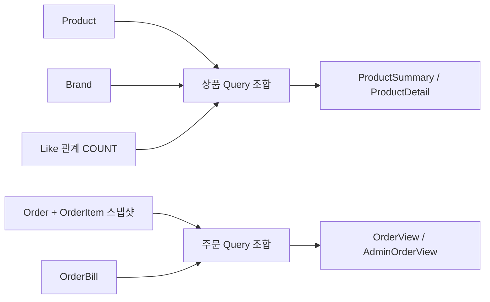

# Read Model / Query

조회 모델은 화면·API에 필요한 값을 모은 결과다. Entity를 그대로 응답하지 않는다.
현재 상품 정보와 주문 생성 당시 정보는 목적이 다르므로 구분한다.

## 응답 모델

필드 이름은 API 계약이다. `?`는 null이 가능한 값이며 금액은 원 단위 정수다.

| 모델 | 응답 필드 |
|---|---|
| BrandDetail | brandId, name, description? |
| BrandSummary | brandId, name |
| ProductSummary | productId, name, price, brand: BrandSummary, likeCount |
| ProductDetail | ProductSummary의 필드 + description?, stock |
| AdminProduct | ProductDetail의 필드 + createdAt |
| LikeItem | ProductSummary의 필드 + likedAt |
| PointBalance | userId, balance |
| OrderItemView | productId, productName, unitPrice, quantity, amount |
| OrderView | orderId, status, totalAmount, paymentAmount?, paymentStatus?, createdAt, items: OrderItemView[] |
| OrderDetail | OrderView와 동일한 필드 |
| AdminOrderView | OrderView의 필드 + userId |
| AdminOrderDetail | AdminOrderView와 동일한 필드 |

주문 목록도 과제에서 요구한 품목·수량·금액·결제 정보를 포함한다.
고객 주문 응답에는 userId 필드가 없고, 관리자 주문 응답에는 구매자를 구분할 userId가 있다.
이는 응답 필드 차이이며 접근 권한을 의미하지 않는다. 인증·인가는 구현하지 않는다.
브랜드는 고객·관리자에 필요한 정보가 같으므로 동일 응답 모델을 사용한다.

## 데이터 출처와 노출 조건

| 조회 | 데이터 출처 | 조건 |
|---|---|---|
| 브랜드 상세·관리자 목록 | Brand | 활성 브랜드만 |
| 상품 목록·상세 | Product + Brand + Like COUNT | 활성 상품·브랜드, 좋아요가 없으면 0 |
| 내 좋아요 목록 | 경로 userId의 Like + Product + Brand + Like COUNT | 활성 상품만, 지정 사용자로 필터링 |
| 내 잔액 | 헤더 userId의 Point | DB에 저장된 현재 balance |
| 내 주문 목록 | Order + OrderItem + OrderBill | 헤더 userId로 필터링, 상품 삭제 후에도 조회 가능 |
| 내 주문 상세 | Order + OrderItem + OrderBill | orderId로 조회, 헤더·본인 여부 검사 없음 |
| 관리자 주문 목록·상세 | Order + OrderItem + OrderBill | 모든 구매자, userId 포함 |

상품 조회의 이름·가격·브랜드는 현재 값이다.
주문 조회의 productName·unitPrice·amount는 스냅샷이며 현재 Product와 조인해 덮어쓰지 않는다.
결제 기록은 OrderBill에서 조합한다. DRAFT의 paymentAmount·paymentStatus는 null이다.
CONFIRMED는 paymentAmount = totalAmount, paymentStatus = PAID다.

## 조회 조합



application은 조회 순서와 결과 조합을, interfaces는 HTTP 응답 변환을 담당한다.
조회는 `GetOrderUseCase` / `GetOrderService`처럼 계약과 구현을 나누고 구현의 execute를 readOnly로 실행한다.
application의 조회 포트(예: ProductQueryPort)와 Criteria·Result를 infrastructure의 QueryAdapter가 구현·사용한다.
domain repository는 도메인 저장·복원 계약에 집중하고, 화면용 조합 조회는 application 포트로 분리한다.
domain은 HTTP DTO나 application 결과 타입을 참조하지 않는다.
QueryAdapter가 application 구현 Service에 의존하는 것은 금지한다.
집계·조인은 infrastructure에서 수행할 수 있지만 응답 정책을 중복 구현하지 않는다.
HTTP Response는 application Result에서 변환하는 별도 record다. 위 응답 필드 계약은 그대로 유지한다.
상품 페이지를 먼저 자른 뒤 likes_desc로 정렬하면 잘못된 순서가 되므로 집계·정렬 후 페이지를 자른다.

## 정렬·페이지

| 목록 / sort | 1차 정렬 | 동률 정렬 |
|---|---|---|
| 상품 latest (기본) | Product.createdAt DESC | productId DESC |
| 상품 price_asc | price ASC | productId DESC |
| 상품 likes_desc | likeCount DESC | productId DESC |
| 내 좋아요 | Like.createdAt DESC | productId DESC |
| 브랜드 | Brand.createdAt DESC | brandId DESC |
| 주문 | Order.createdAt DESC | orderId DESC |

상품의 brandId는 선택 필터이며 고객·관리자 목록에 같은 규칙을 적용한다.
필터 값이 양의 정수이지만 브랜드가 없거나 삭제되었다면 빈 목록이다.
page는 0부터 시작하고 기본 0, size는 기본 20·최대 100이다. 잘못된 값은 400이다.
동률 보조 정렬은 동일 데이터의 순서를 안정화하지만, 페이지 조회 사이의 데이터 변경까지 고정하지는 않는다.

```json
{
  "meta": { "result": "SUCCESS", "errorCode": null, "message": null },
  "data": { "items": [], "page": 0, "size": 20, "totalElements": 0, "totalPages": 0 }
}
```

totalElements는 필터·삭제·지정 사용자 조건을 적용한 개수다. 좋아요 조인으로 상품이 중복 집계되지 않게 한다.
범위 밖 페이지도 같은 봉투와 빈 items를 반환하며 전체 개수는 실제 필터 결과를 유지한다.
응답 시각은 UTC ISO 8601 문자열로 통일한다. 예: `2026-09-16T07:00:00Z`.

## 검증할 사례

- 좋아요가 없는 상품도 목록에 나오고 likeCount는 0이다.
- 같은 가격·좋아요 수의 상품은 ID 내림차순이며 페이지 간 중복이 없다(데이터 변경 없는 조건).
- 상품 수정은 현재 조회에 반영되지만 기존 주문의 이름·가격은 변하지 않는다.
- 삭제 상품은 목록·내 좋아요에서 빠지며 과거 주문 품목에는 남는다.
- 관리자 주문에는 userId가 있고, 고객 주문 목록에는 헤더로 지정한 사용자의 주문만 있다.
- 좋아요 목록은 경로 userId를 사용하며 헤더와 비교하지 않는다. 주문 상세는 orderId로 조회한다.
