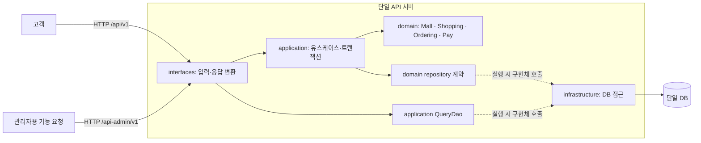
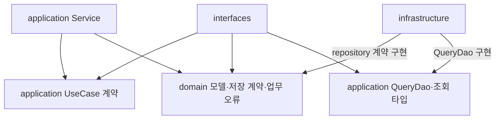
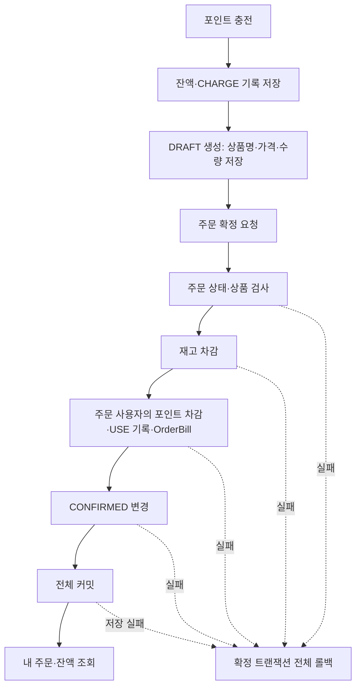

# 버드뷰

고객과 관리자의 요청을 하나의 API 서버에서 처리하고, 네 업무 영역의 데이터를 같은 DB에 저장한다.
이 문서는 전체 그림이며 자세한 계약은 [요구사항](01-requirements.md)부터 확인한다.

## 시스템 구성과 요청 방향

쓰기 응답은 application·interfaces에서 조합하고, GET은 DAO 조회 record를 ApiResponse로 감싸 반환한다.
점선은 실행 중 구현체가 호출되는 관계다. domain 소스가 infrastructure에 의존한다는 뜻이 아니다.
과제 원문의 인증·인가 요구는 이번 학습 범위에서 제외한다. 두 경로 모두 권한·CSRF 검사를 구현하지 않는다.
필요한 API만 X-USER-ID로 fixture 사용자를 지정한다. 좋아요 목록은 경로 userId, 주문 상세·확정은 orderId를 쓴다.
상품·브랜드 조회와 관리자용 기능은 사용자 헤더가 필요 없다. 자세한 입력은 [API 계약](05-use-cases.md)을 따른다.

## 코드의 허용 의존

| 계층 | 하는 일 | 의존 제한 |
|---|---|---|
| interfaces | HTTP 입력·헤더·응답 변환 | infrastructure 직접 참조 금지 |
| application | 쓰기 대상·데이터 확인, 쓰기 순서·트랜잭션, DAO 계약 | interfaces·infrastructure 구현 참조 금지 |
| domain | 순수 Java 상태·업무 규칙·repository 계약 | 다른 계층·Spring·JPA·HTTP 참조 금지 |
| infrastructure | 저장·조회 계약 구현, JPA 객체·Mapper | application 구현 의존 및 HTTP·업무 정책 중복 금지 |

패키지는 계층 → Context → 기능 순서다. 쓰기 입력·결과·응답은 계층별 record, 조회는 DAO record를 직접 반환한다.
쓰기 UseCase의 Service.execute가 쓰기 트랜잭션을, 조회 DAO 구현의 공개 메서드가 readOnly 트랜잭션을 소유한다.
도메인과 JPA Entity는 분리하며, 도메인은 create·restore와 의미 있는 행동으로 상태를 관리한다.
변경 후 repository.save를 명시하고 infrastructure의 전용 Mapper로 저장 객체에 반영한다.
자세한 규칙·이유·예시는 [개발 컨벤션](conventions.md)에 둔다.

## 업무별 한눈에 보기

| 업무 | 담당 Context | 대표 저장 변화 |
|---|---|---|
| 브랜드·상품 운영 | Mall | 정보·삭제 상태·재고 |
| 좋아요 | Shopping | User–Product 관계 |
| 주문 | Ordering | DRAFT 생성, 품목 스냅샷, CONFIRMED 전환 |
| 충전·결제 | Pay | 잔액, PointBill, OrderBill |

좋아요 관계·내 목록은 즉시 반영하고 숫자·인기순은 시작 시 및 이전 실행 종료 10초 후 갱신하는 DB 집계를 사용한다. 주문은 OrderItem 스냅샷을 읽는다.
조회 조합은 여러 Context 자료를 사용할 수 있지만 데이터 소유권까지 이동시키지는 않는다.

## 대표 흐름: 충전부터 주문 조회까지

충전·주문 생성·주문 확정은 서로 다른 요청이다.
확정의 E~I 구간만 하나의 트랜잭션이며, 실패해도 앞서 완료한 충전과 DRAFT 생성은 유지한다.
예를 들어 10,000원 충전 후 7,000원 확정에 성공하면 잔액은 3,000원이다.

## 실행·검증 기준

[개발 계획](development-plan.md)의 7개 PR을 volume-2/main 기준으로 순차 진행한다. 계획 정리는 PR 01에 포함한다.
동시성 구현·검증은 다음 학습으로 미루며 순차 재확정 거절·DB 유일성·단일 요청의 전체 롤백은 유지한다.

로컬 실습 서버는 `127.0.0.1`에 바인딩하고 fixture 데이터로 검증한다.
공개 배포·실제 비밀정보·개인정보 사용은 이번 과제 범위가 아니다.
관리자용 기능도 인증·인가 없이 실제 HTTP 입력·응답·저장 결과로 검증한다.
도메인 규칙, DB 재조회, 실제 HTTP 연결을 검증한 뒤 Checkstyle·ArchUnit·모듈 검사를 수행한다.
이 문서 묶음은 그 구현·검증의 기준이며 실행 완료 보고서는 아니다.
