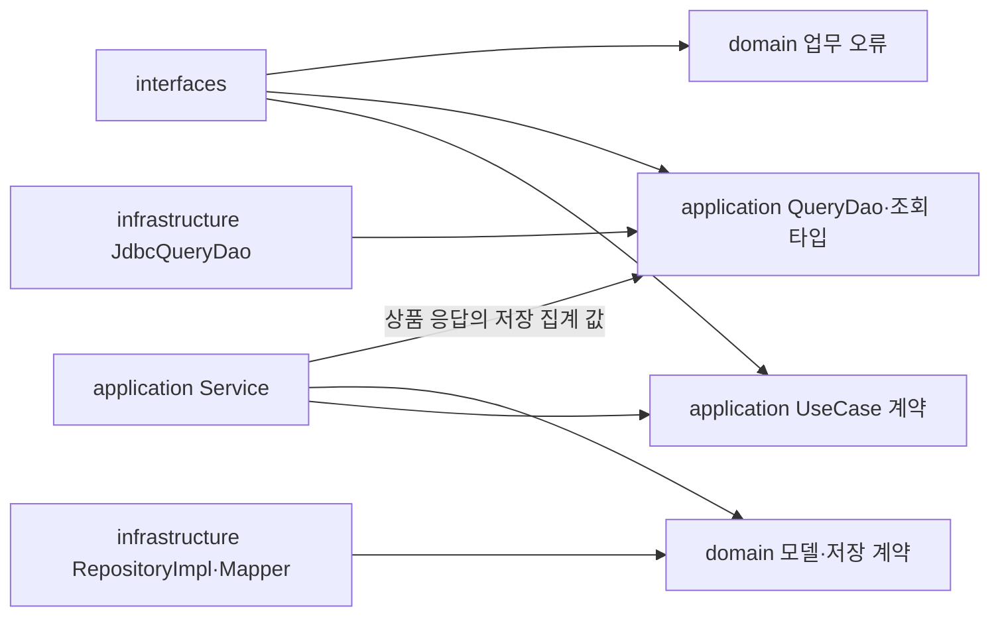

# 개발 컨벤션

2주차 신규 기능에 적용하는 **합의된 구현 기준**이다. 규칙의 요약은 [AGENTS.md](../../AGENTS.md)에 둔다.
비즈니스 정책·HTTP 계약은 [설계 안내](README.md)를 따른다. 이 문서는 기능이나 검사 설정의 구현 완료를 의미하지 않는다.
총 7개 PR의 범위·순서·완료 조건은 [개발 계획](development-plan.md)을 따른다. 과제 원문의 인증·인가는 이번 범위에서 제외한다.
동시성 구현·검증은 다음 학습으로 미룬다. 순차 재확정 거절·DB 유일성 제약·단일 요청의 전체 롤백은 유지한다.

## 1. 구조와 이름

패키지는 **계층 → Context → 기능**으로 나눈다. Context 이름은 `mall`, `shopping`, `ordering`, `pay`다.

```text
com.loopers
├── interfaces.api.ordering.order    # Request, Response, Controller
├── application.ordering.order      # UseCase, Service, Command, Result
├── application.mall.product        # QueryDao, Criteria, 조회 record
├── domain.mall.product             # Product, Stock, ProductRepository
└── infrastructure.mall.product     # JpaEntity, JpaRepository, RepositoryImpl, EntityMapper
```

| 대상 | 이름·규칙 | 이유 |
|---|---|---|
| 도메인 / JPA 객체 | Product / ProductJpaEntity | 업무 규칙과 저장 기술 분리 |
| 행동별 실행 계약 | ConfirmOrderUseCase, execute | 한 유스케이스의 입력·결과 명확화 |
| 실행 구현 | ConfirmOrderService | UseCase 인터페이스와 구현 분리 |
| 조회 실행 | ProductQueryController → ProductQueryDao | 조회 Service 없이 계약 직접 호출 |
| 저장 계약 / 구현 | ProductRepository / ProductRepositoryImpl | domain이 계약을 소유 |
| JPA 접근 | ProductJpaRepository | Spring Data 타입을 infrastructure 안에 제한 |
| 조회 계약 / 구현 | ProductQueryDao / JdbcProductQueryDao | JdbcClient로 SQL·조회 모델 조합 |
| 저장 객체 변환 | ProductEntityMapper | 변환 코드를 repository에서 분리 |

순수 도메인은 기존 JPA `BaseEntity`를 상속하지 않는다. 기존 Example은 참고용으로 보존한다.
Money처럼 공유할 값은 `domain.shared`에 둘 수 있지만, Context별 업무 정책까지 공통화하지 않는다.

## 2. 의존과 책임

화살표는 코드의 의존 방향이다. infrastructure가 application 구현 서비스를 호출하는 것은 허용하지 않는다.



| 위치 | 책임 | 넣지 않을 것 |
|---|---|---|
| interfaces | HTTP 형식·입력 구조 검사, DTO 변환, 오류 HTTP 매핑 | DB 직접 접근, 재고·결제 판단 |
| application | 쓰기 대상·사용자별 데이터·객체 간 조건, 호출 순서·쓰기 트랜잭션, DAO 계약 | HTTP 타입, infrastructure 구현 참조 |
| domain | 상태·업무 규칙·저장 계약 | Spring·JPA·HTTP, 나머지 계층 의존 |
| infrastructure | 저장·조회 구현, JPA 객체, 변환 | application Service 의존, 업무 정책 중복 |

domain의 repository는 도메인·기본 Java 타입을 사용한다. JPA Entity·Spring Data Page를 계약에 노출하지 않는다.
application QueryDao의 입력·결과도 JPA·HTTP·Spring Data Page 타입을 포함하지 않는다.
순수 domain은 생성자·메서드 인자로 협력 객체를 받고, 필요한 Spring Bean 연결은 바깥 구성에서 담당한다.

## 3. 도메인 생성과 변경

| 규칙 | 적용 예·이유 |
|---|---|
| 신규 생성과 복원 구분 | create는 신규 상태, restore는 저장 상태를 유효하게 구성 |
| 생성자는 감춤 | private 생성자와 정적 팩터리로 생성 경로를 제한 |
| 복원도 불변식 검사 | 음수 재고·잘못된 합계가 DB에 있어도 유효한 객체로 취급하지 않음 |
| 공개 setter 금지 | decreaseStock, confirm처럼 의미 있는 행동으로 변경 |
| 필요한 값만 값 객체 | Money·Stock부터 적용, ID·이름은 기본 타입으로 시작 |
| 외부에서 내부 상태 변경 금지 | 주문 품목 컬렉션은 방어적으로 복사하고 수정 불가 형태로 노출 |

Money는 잔액을 표현하도록 0을 허용한다. 가격·충전·결제에서는 별도로 양수를 검사한다.
복원은 신규 생성의 부수 효과를 재실행하지 않으며, CONFIRMED 같은 저장된 유효 상태도 복원한다.
실패할 수 있는 검증·계산을 먼저 마친 뒤 값을 바꾼다. 예외 후 메모리 상태도 유지해야 한다.

```java
public void decrease(int quantity) {
    if (quantity <= 0) {
        throw new DomainException(DomainErrorCode.INVALID_QUANTITY);
    }
    if (quantity > value) {
        throw new DomainException(DomainErrorCode.INSUFFICIENT_STOCK);
    }
    value -= quantity;
}
```

위 코드는 Stock 행동의 형태 예시다. 금액·합산 수량 계산도 범위 초과를 검사한 후 반영한다.

## 4. UseCase와 전달 객체

쓰기는 `Request → Command → Result → Response`를 계층별 record로 분리한다.
쓰기에 필요한 도메인 복원은 repository를 유지한다. domain은 HTTP DTO를 모른다.
조회는 `Request → Criteria → 조회 record → ApiResponse`이며 별도 Response 복사를 하지 않는다.
고객·관리자 GET은 QueryController로 분리하고 application의 QueryDao를 직접 호출한다. 조회 UseCase·Service는 두지 않는다.
DAO는 같은 DB에서 Context 간 조인·정렬·조회 모델 조합을 수행한다. URL·응답 필드·데이터 소유권은 유지한다.
Spring JDBC의 JdbcClient와 이름 있는 파라미터를 사용하며 복합 결과는 RowMapper로 변환한다.
Controller는 입력 검사와 Optional 상세 결과의 404 처리를 맡는다. DAO는 HTTP 오류 정책을 구현하지 않는다.
상품의 쓰기 성공 Result에 필요한 likeCount만 DAO로 저장 집계 값을 읽으며 상품 전체를 재조회하지 않는다.

```java
public interface ConfirmOrderUseCase {
    ConfirmOrderResult execute(ConfirmOrderCommand command);
}

public record ConfirmOrderCommand(long orderId) {}
```

각 public 타입은 별도 파일에 둔다. 사용자 지정이 필요한 Command/Criteria의 userId는 학습용 입력에서 가져온다.
X-USER-ID는 인증 정보가 아니다. 좋아요 목록은 경로 userId, 주문 상세·확정은 orderId를 사용한다.
ConfirmOrderCommand는 사용자 입력을 받지 않으며, 결제 대상은 조회한 Order의 userId다.
`ConfirmOrderService`는 위 인터페이스를 구현하고 생성자로 repository 등 계약을 주입받는다.
쓰기 Service의 `execute`에는 `@Transactional`, DAO 구현의 공개 조회 메서드에는 `@Transactional(readOnly = true)`를 둔다.
트랜잭션은 Spring이 관리하는 구현체를 통해 진입한다. domain과 Mapper에는 트랜잭션을 선언하지 않는다.

`@XUserId` resolver는 형식 검사 후 UserQueryDao.findById를 호출하며 없으면 USER_NOT_FOUND, 있으면 ID를 반환한다.
형식 오류 시 DAO를 호출하지 않는다. 경로 userId는 좋아요 QueryController에서 같은 DAO로 검사한다.
쓰기 Service의 사용자 존재 재검사와 UserValidator는 제거한다. 직접 호출자는 존재하는 사용자 ID를 제공해야 한다.
사용자 조회 모델은 ID만 가진 record다. domain UserRepository의 existsById를 제거하고 fixture도 조회 DAO를 사용한다.

좋아요 관계·내 목록은 즉시 반영하되 likeCount·인기순은 Shopping의 저장 집계 값을 사용한다.
단일 commerce-api의 스케줄러가 시작 시 1회, 이전 실행 종료 10초 후 application 집계 Service를 호출한다.
집계 쓰기 계약은 조회 DAO와 분리하고 전체 COUNT 저장을 한 트랜잭션으로 처리한다. 실패 시 이전 값을 유지한다.
집계 행이 없으면 0으로 표시하며 마지막 관계 취소 후에도 0으로 갱신한다. 자세한 계약은 [조회 모델](06-read-models.md)을 따른다.

## 5. 저장과 Mapper

| 담당 | 수행할 일 |
|---|---|
| RepositoryImpl | DB 조회, 신규·기존 저장 구분, 기존 Entity 확보, 저장 호출 |
| EntityMapper | toDomain으로 restore 호출, 신규 Entity 변환, 기존 Entity에 저장 상태 반영 |
| JpaEntity | 매핑·저장 상태 표현, 업무 판단 없이 전달받은 상태 반영 |

Mapper는 infrastructure의 구체 클래스다. Mapper 인터페이스나 변환 라이브러리는 추가하지 않는다.
기존 Entity 반영은 `apply`처럼 의도가 드러나는 메서드로 제공하며 임의의 공개 setter는 만들지 않는다.
기존 ID·생성 시각 등 저장 메타데이터를 새 기본값으로 덮어쓰지 않는다.
신규 저장의 repository 결과는 생성된 ID가 반영된 도메인 객체를 반환한다.

```java
Product product = productRepository.find(productId)
    .orElseThrow(() -> new ApplicationException(ApplicationErrorCode.PRODUCT_NOT_FOUND));
product.decreaseStock(quantity);
productRepository.save(product);
```

위 코드는 처리 순서를 줄인 예시다. **분리된 도메인의 변경은 JPA dirty checking 대상이 아니므로 save를 명시한다.**
Order·OrderItem의 저장·복원은 Aggregate 전체를 다루며 스냅샷·품목을 누락하지 않는다.
주문 확정은 모든 재고·Point·PointBill·OrderBill·Order 상태를 같은 트랜잭션으로 저장한다.
어느 저장에서든 실패하면 전체 롤백한다. 순차 재확정은 주문 상태 검사로 거절하며 Mapper 분리가 이를 대신하지 않는다.
잠금·버전 검증·재시도·동시 요청 테스트는 이번 PR 완료 조건에 포함하지 않는다.

## 6. 검증과 오류

| 경계 | 검사·표현 |
|---|---|
| Request | 누락, JSON 타입, 입력 구조 |
| domain | 값 범위, 양수·잔액·재고, 상태 전이, 합계 등 업무 불변식 |
| application | 쓰기 대상·사용자별 데이터·여러 객체의 조건; DAO 계약·조회 타입 |
| resolver / QueryController | 헤더·경로 사용자 존재, Optional 상세 결과의 없음 처리 |
| interfaces 오류 처리 | 내부 오류를 기존 HTTP 상태·ApiResponse로 변환 |

domain은 공통 `DomainException`과 `DomainErrorCode`를 사용하며 HTTP 상태나 기존 ErrorType을 참조하지 않는다.
application의 사용자·대상 존재 오류도 HTTP를 직접 담지 않는 별도 오류로 표현하고 interfaces에서 매핑한다.
업무 코드 `INSUFFICIENT_STOCK`의 외부 표현은 기존 계약의 `409 / Conflict`다.
내부 코드를 추가한다고 외부 errorCode를 바꾸거나 응답 필드를 늘리지 않는다.
필요한 사용자 헤더의 누락·형식 오류는 400, 없는 사용자는 404로 변환한다.
Spring Security·ADMIN 역할·CSRF·소유권 검사와 관련 401·403 테스트는 추가하지 않는다.

## 7. 테스트: 업무 규칙을 엄격하게

| 대상 | 방법 | 반드시 볼 것 |
|---|---|---|
| domain | Spring·DB 없이 실제 객체 | 정상·경계·오류와 실패 후 값 유지 |
| UseCase | 실제 도메인 + mock repository/DAO | 사용자별 데이터 구분, 협력 순서, 실패 시 후속 처리 중단 |
| QueryDao | 실제 테스트 DB | 조회·조인·페이지·집계·주문 스냅샷 보존 |
| resolver | mock UserQueryDao | 정상·400·404, 형식 오류 시 DAO 미호출 |
| Mapper | 복잡한 변환은 DB 없는 테스트 | 주문 품목·가격 스냅샷·메타데이터 보존 |
| repository·트랜잭션 | 실제 테스트 DB, flush/clear 후 재조회 | 저장 관계·유일성·전체 롤백 |
| HTTP | 실제 Controller·application·repository·DB | 입력·응답·사용자별 데이터와 저장 상태 |

핵심 업무 규칙은 Red → Green → Refactor로 진행하고 각 단계 결과를 확인한다.
재고·잔액의 0, 정확히 필요한 값, 1 부족, 최댓값·계산 초과를 검사한다.
중복 품목 합산, 삭제 후 행동, 재확정, create·restore의 잘못된 상태 거절도 포함한다.
도메인은 메모리 상태 유지를, DB 통합 테스트는 여러 객체의 저장 상태 롤백을 각각 검증한다.
단순 getter·필드 복사를 재현하는 테스트보다 업무 규칙과 손실 위험이 있는 변환을 검증한다.
한글 `@DisplayName`, 기능별 `@Nested`, `arrange / act / assert`와 기존 JUnit·AssertJ 관례를 유지한다.

## 8. 스타일·자동 검사·작업 순서

Java 21, 기존 들여쓰기·중괄호 스타일, 생성자 주입을 사용한다.
Spring 구성요소에는 `@RequiredArgsConstructor`를 사용할 수 있다. 별표·미사용 import는 금지한다.
`.editorconfig`의 본문 130자와 `*Test.java` 줄 길이 예외를 유지한다.

| 검사 | 연결할 기준 |
|---|---|
| Checkstyle | 과제의 10.26.1, AvoidStarImport·UnusedImports, 경고 0, check 연결 |
| ArchUnit 기본 | domain → 외부 계층 금지, application → interfaces/infrastructure 금지, interfaces → infrastructure 금지 |
| 신규 구조 추가 검사 | 네 Context와 신규 공통 domain의 Spring·JPA·HTTP 의존 금지, infrastructure → application 구현 금지 |
| 검사 대상 | 실제 신규 구현 포함; Example은 보존하며 신규 순수성 규칙 적용 대상에서 구분 |

ArchUnit은 과제의 1.5.0을 기존 JUnit에 연결하는 기준이다. 빈 패키지를 검사하고 통과했다고 보고하지 않는다.
Checkstyle·ArchUnit 설정은 PR 01에서 연결되어 병합됐다. 이번 보완에서도 기존 규칙을 유지하고 실제 실행 결과를 별도로 기록한다.
기능별로 계약 확인 → 변경 책임·범위·테스트 제시 → 구현·diff·관련 테스트 → 기능 완료 검사 순서로 진행한다.
이후 구현 완료 시 `./gradlew :apps:commerce-api:check`와 관련 검사를 실행하고 성공·실패·skip 결과를 기록한다.
미정 정책은 질문하고, 검사 통과를 위해 기대값·업무 규칙·검사 규칙을 삭제하거나 완화하지 않는다.
