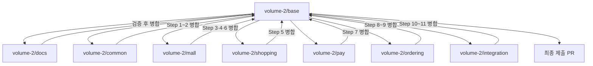
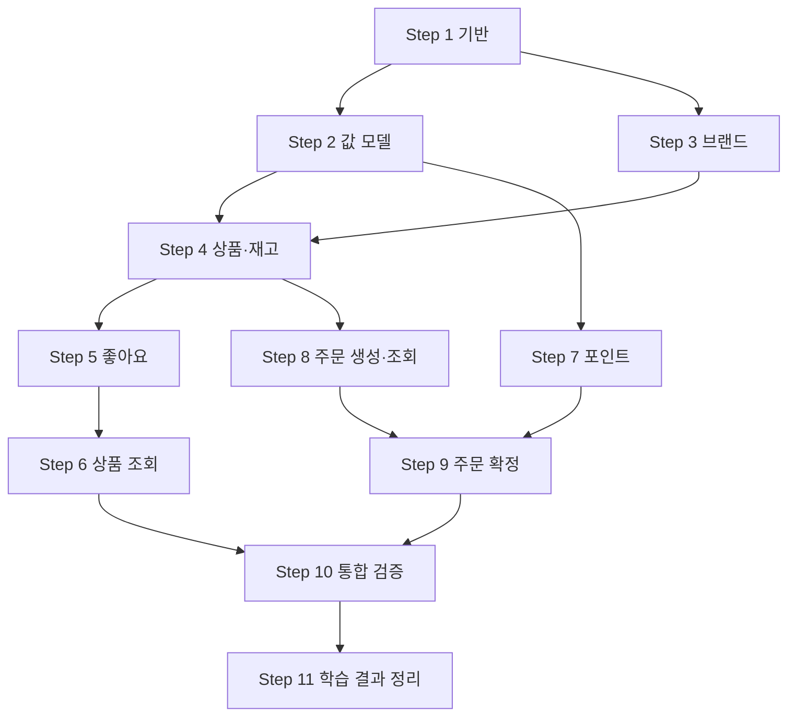

# 단계별 개발 계획

목표는 **설계·도메인 모델링·TDD 학습**이다. 날짜 대신 각 Step의 완료 조건으로 진행 상황을 판단한다.
현재는 계획만 작성한 상태이며 아래 구현·검사 항목은 모두 미완료다.
설계 계약은 [요구사항](01-requirements.md), 구현 방식은 [컨벤션](conventions.md)을 따른다.

## 학습 범위와 사용자 입력

과제 원문의 인증·인가 요구는 사용자와 합의하여 이번 학습 범위에서 제외한다.
로그인, Spring Security, ADMIN 역할·CSRF, 본인 여부 검사 및 관련 401·403 테스트는 구현하지 않는다.
`X-USER-ID`는 테스트할 fixture 사용자를 지정하는 입력이며 인증된 요청자가 아니다.
헤더 이름은 대소문자를 구분하지 않는다.

| 기능 | 사용자 지정 방식 |
|---|---|
| 좋아요 등록·취소, 포인트 충전·잔액, 주문 생성·목록 | X-USER-ID 필수 |
| 좋아요 목록 | 경로 userId 사용, 헤더 불필요·일치 검사 없음 |
| 주문 상세·확정 | orderId 사용, 결제 대상은 저장된 주문의 userId |
| 상품·브랜드 조회, 관리자용 기능 | 사용자 헤더 불필요 |

필요한 헤더의 누락·잘못된 형식은 400, 지정한 사용자가 없으면 404다.
헤더를 사용하지 않는 API는 전달된 헤더로 대상을 바꾸거나 권한을 검사하지 않는다.
관리자 경로는 기능 구분용이다. 사용자별 데이터 필터링과 인증·인가를 혼동하지 않는다.

## 브랜치 전략

브랜치는 `volume-2/<작업영역>` 형식을 사용한다. 현재 로컬 기준 브랜치가 `volume-2`이므로,
하위 이름을 만들기 전에 `volume-2/base`로 이름을 변경해야 한다.
Git은 `volume-2`와 `volume-2/docs`처럼 상위 ref와 하위 ref를 동시에 저장할 수 없다.
실제 변경 전 원격에 `volume-2`가 존재하는지 다시 확인하고, 존재한다면 원격 이름도 정리한 뒤 작업 브랜치를 게시한다.

| 브랜치 | 담당 범위 | 포함 Step | 병합 시점 |
|---|---|---|---|
| `volume-2/base` | 전체 작업의 누적 기준 | 전체 | 각 작업 브랜치의 완료 검증 후 병합 |
| `volume-2/docs` | 설계·컨벤션·개발 계획 | 문서 선행 작업, Step 11 | 문서 검증 후 먼저 base에 병합하고 구현 중 변경은 각 기능과 함께 갱신 |
| `volume-2/common` | 검사 설정·공통 오류·fixture·Money·Stock | Step 1~2 | 공통 테스트·검사 통과 후 base에 병합 |
| `volume-2/mall` | Brand·Product·Stock·상품 조회 | Step 3~4, 6 | Mall API와 관련 검사 통과 후 base에 병합 |
| `volume-2/shopping` | User·Like·좋아요 목록 | Step 5 | Mall 병합 이후 생성하고 좋아요 검증 후 base에 병합 |
| `volume-2/pay` | Point·PointBill·포인트 API | Step 7 | common 병합 이후 생성하고 Pay 검증 후 base에 병합 |
| `volume-2/ordering` | Order·OrderItem·OrderBill·주문 API | Step 8~9 | Mall·Pay 병합 이후 생성하고 롤백·동시성 검증 후 base에 병합 |
| `volume-2/integration` | 전체 연결·회귀 수정·최종 문서 동기화 | Step 10~11 | 전체 검사와 문서 일치 확인 후 base에 병합 |

작업 브랜치는 항상 **최신 `volume-2/base`**에서 생성한다. 선행 Context가 필요한 브랜치는 해당 변경이 base에
병합된 뒤 생성하거나, 이미 생성했다면 base를 반영한 후 작업을 시작한다. Context 브랜치끼리 직접 병합하지 않는다.
최종 제출 PR은 모든 작업 브랜치가 모인 `volume-2/base`에서 대상 기본 브랜치로 만든다.

브랜치 생성·병합은 계획의 체크포인트이며 이 문서 작성 작업에서 실제로 수행하지 않는다.

## Step별 목표와 완료 조건

| 단계 | 작업 | 완료 조건 | 커밋 시점 | 관련 요구사항 |
|---|---|---|---|---|
| Step 1. 개발·테스트 기반 | 테스트 DB, Checkstyle·ArchUnit, 공통 오류, fixture·헤더 입력 | 테스트 기준선, 사용자 입력 검증, 실제 신규 코드 검사 | 기반 검사와 사용자 입력 테스트가 모두 통과한 뒤 1회 | R14 |
| Step 2. 공통 값 모델 | Money·Stock 모델링과 TDD | 정상·경계·계산 초과·실패 후 상태 유지 | Money 완료 후, Stock 완료 후 각각 1회 | R06, R07, R08, R12 |
| Step 3. 브랜드 | 도메인·저장·UseCase·API 연결 | 생성·수정·논리 삭제·조회 검증 | 도메인 규칙 완료 후, 저장·API 연결 완료 후 각각 1회 | R01, R10 |
| Step 4. 상품·재고 | 상품 모델·브랜드 참조·재고 행동 | 재고 부족·삭제 후 변경 금지·브랜드 유지·브랜드 삭제 제한 | 상품·재고 도메인 완료 후, CRUD·삭제 조건 연결 후 각각 1회 | R10, R11, R12 |
| Step 5. 좋아요 | 관계 모델, 등록·취소·목록 | 관계 유일성·반복 요청·삭제 상품 처리·사용자별 구분 | 등록·취소 완료 후, 목록 조회 완료 후 각각 1회 | R04, R05 |
| Step 6. 상품 조회 | 조회 포트·집계·필터·페이지·정렬 | 응답 조합·동률 정렬·잘못된 조건 검증 | 목록·정렬 완료 후, 상세·관리자 조회 완료 후 각각 1회 | R02, R03, R11 |
| Step 7. 포인트 | 잔액·충전·차감·PointBill | 입력 범위·잔액 부족·계산 초과·기록 정합성 | 도메인·기록 완료 후, 충전·조회 API 완료 후 각각 1회 | R06 |
| Step 8. 주문 생성·조회 | Order·OrderItem·DRAFT·스냅샷·합계 | 중복 수량 합산·생성 시 차감 없음·과거 정보 유지 | 주문 생성 완료 후, 고객·관리자 조회 완료 후 각각 1회 | R07, R09, R13 |
| Step 9. 주문 확정 | 재고·포인트·결제 기록·상태 전환 | 전체 롤백·재확정 거절·중복 차감 방지 | 확정·롤백 완료 후, 동시성 보호 완료 후 각각 1회 | R08, R09, R13 |
| Step 10. 통합 검증 | API 25개·요구사항 대조, 연결·회귀 검사 | 충전→다품목 주문→확정→잔액 조회 및 검사 통과 | 통합 실패 수정과 전체 검사 통과 후 1회 | R01~R14 |
| Step 11. 학습 결과 정리 | 설계 갱신, TDD 사례·설계 판단, 제출 글 | 근거를 갖춘 PR 설명·기술 글 초안 | 문서와 실제 구현의 일치 확인 후 1회 | 전체 |

Step 3의 연결 상품 삭제 제한은 Step 4에서 완성한다. Step 5는 좋아요 목록에 필요한 조회부터 연결한다.
Step 6에서 고객·관리자 상품 조회와 집계·정렬을 완성한다.
Step 8의 DRAFT 조회에는 결제 결과가 없고, Step 9에서 확정 결과 조회까지 완성한다.
Step 9 시작 시 잠금·버전 검증 방식과 잠금 순서를 결정·기록한 뒤 동시성 테스트를 작성한다.

## 선행 관계

화살표는 필요한 선행 작업이다. 실제 진행은 Step 순서대로 작은 기능 하나씩 수행한다.

## 진행 체크리스트

- [ ] 현재 `volume-2`의 로컬·원격 상태를 확인하고 `volume-2/base` 기준 브랜치 준비
- [ ] `volume-2/docs`: 설계·컨벤션·개발 계획 검증 및 병합
- [ ] `volume-2/common`: Step 1~2 완료 및 병합
- [ ] `volume-2/mall`: Step 3·4·6 완료 및 병합
- [ ] `volume-2/shopping`: Step 5 완료 및 병합
- [ ] `volume-2/pay`: Step 7 완료 및 병합
- [ ] `volume-2/ordering`: Step 8~9 완료 및 병합
- [ ] `volume-2/integration`: Step 10~11 완료 및 병합
- [ ] Step 1: 기반 검사·사용자 입력 연결
- [ ] Step 2: Money·Stock 경계값 TDD
- [ ] Step 3: 브랜드 기본 기능 연결
- [ ] Step 4: 상품·재고 및 브랜드 삭제 제한 완성
- [ ] Step 5: 좋아요 관계·목록 연결
- [ ] Step 6: 상품 조회·집계·정렬 완성
- [ ] Step 7: 포인트·기록 정합성 검증
- [ ] Step 8: 주문 생성·스냅샷·조회 검증
- [ ] Step 9: 확정·전체 롤백·중복 차감 방지 검증
- [ ] Step 10: 전체 연결·회귀 검사 통과
- [ ] Step 11: 설계·TDD 근거·제출 글 정리

## 각 기능의 작업 순서

1. 정책·API 계약, 정상 결과와 실패 후 유지 상태를 확인한다.
2. 변경 책임·파일 범위·관련 테스트를 밝힌다.
3. 핵심 규칙은 실패 테스트 → 최소 구현 → 리팩터링으로 진행한다.
4. domain → 저장·Mapper → UseCase → HTTP를 연결하고 관련 테스트를 수행한다.
5. diff와 관련 테스트 결과를 확인하고 아래 커밋 기준을 충족하면 기능 단위로 커밋한다.
6. Step 완료 시 Checkstyle·ArchUnit·모듈 검사를 확인하고 완료 조건을 충족하면 체크한다.

도메인은 정상·경계·실패와 메모리 상태 유지를 검증한다.
DB 통합 테스트는 저장 관계·유일성·재조회·전체 롤백을, HTTP는 입력·응답·저장 결과를 검증한다.
대표 연결 사례는 10,000원 충전 후 7,000원 주문 확정, 잔액 3,000원이다.
실패·skip·환경 문제는 원인과 다음 조치를 기록하며 검사 기준을 낮춰 완료 처리하지 않는다.
제출 준비는 초안 작성까지다. 원격 PR 생성·게시·제출은 별도 요청에 따른다.

## 커밋 기준

커밋은 코드의 책임과 테스트 결과가 함께 설명되는 최소 기능 단위로 만든다.
Red 상태는 학습 기록으로 남기되 커밋하지 않고, Green 이후 관련 테스트가 통과하면 첫 커밋을 만든다.
리팩터링이 동작 변경 없이 독립적으로 설명될 만큼 크면 별도 `refactor:` 커밋으로 분리한다.

| 시점 | 커밋 여부 | 기준 |
|---|---|---|
| 실패 테스트 작성 직후 | 커밋하지 않음 | 의도한 이유로 실패하는지 확인하고 Green까지 진행 |
| 최소 구현으로 관련 테스트 통과 | 커밋 | 도메인 규칙과 해당 테스트를 함께 포함 |
| 저장·UseCase·HTTP 연결 완료 | 커밋 | 관련 통합·HTTP 테스트와 diff 확인 |
| 리팩터링 완료 | 필요할 때 별도 커밋 | 동작 변경 없음과 테스트 재통과 확인 |
| Step 완료 | 커밋 누락 확인 | 미완성 코드·실패 테스트·무관한 변경이 섞이지 않았는지 확인 |
| 전체 회귀 검사 수정 | 원인별 커밋 | 서로 다른 오류 수정을 한 커밋에 합치지 않음 |
| 문서 동기화 | 문서 커밋 | 구현과 계약이 일치하는 시점에 반영 |

커밋 메시지는 저장소의 기존 형식인 `type: 한글 요약`을 따른다.

| type | 사용 범위 | 예시 |
|---|---|---|
| test | 테스트 기반·대표 TDD 계약만 독립적으로 추가할 때 | `test: 재고 차감 경계값 검증` |
| feat | 동작 가능한 기능 단위를 완성할 때 | `feat: 브랜드 등록과 조회 기능 구현` |
| fix | 검증 중 발견한 결함을 수정할 때 | `fix: 주문 확정 실패 시 재고 롤백` |
| refactor | 외부 동작을 바꾸지 않고 구조를 정리할 때 | `refactor: 상품 저장 변환 책임 분리` |
| docs | 설계·학습 기록·제출 문서를 맞출 때 | `docs: 주문 확정 TDD 과정 정리` |
| build | Gradle·Checkstyle·ArchUnit 설정을 변경할 때 | `build: Checkstyle과 ArchUnit 검사 연결` |

하나의 커밋에는 해당 기능 코드와 이를 증명하는 테스트를 함께 둔다.
Checkstyle·ArchUnit 설정은 Step 1의 별도 `build:` 커밋으로 분리하고 기능 코드와 섞지 않는다.
사용자가 작업한 파일이나 범위 밖 변경은 커밋에 포함하지 않는다. 커밋 전 `git diff`와 staging 목록을 확인한다.
커밋 메시지 예시는 방향을 보여주며 실제 변경 내용에 맞춰 구체적으로 작성한다.

## 브랜치별 커밋 체크포인트

| 브랜치 | 권장 커밋 흐름 |
|---|---|
| `volume-2/docs` | `docs: 2주차 설계 문서 정리` → `docs: 개발 컨벤션과 단계별 계획 추가` |
| `volume-2/common` | `build: Checkstyle과 ArchUnit 검사 연결` → `feat: 학습용 사용자 입력과 공통 오류 구성` → Money·Stock 기능별 커밋 |
| `volume-2/mall` | Brand 도메인 → Brand 저장·API → Product·Stock 도메인 → 상품 저장·API → 조회·정렬 순서로 커밋 |
| `volume-2/shopping` | Like 관계 규칙 → 등록·취소 → 사용자별 목록 조회 순서로 커밋 |
| `volume-2/pay` | Point·PointBill 규칙 → 저장 → 충전·잔액 API 순서로 커밋 |
| `volume-2/ordering` | Order·OrderItem 규칙 → DRAFT 생성·조회 → 확정·결제 → 롤백 → 동시성 보호 순서로 커밋 |
| `volume-2/integration` | 실패 원인별 `fix:` 커밋 → 최종 문서 `docs:` 커밋 |

각 브랜치를 base에 병합하기 직전에 관련 테스트와 모듈 검사를 다시 실행하고 결과를 기록한다.
병합 후에는 base에서 최소 회귀 검사를 실행한 다음 후속 브랜치를 생성한다.
여러 Context를 함께 고쳐야 하는 통합 결함은 `volume-2/integration`에서 원인별로 수정한다.
