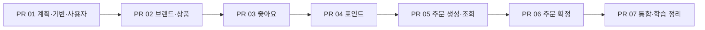

# PR 단위 개발 계획

목표는 **설계·도메인 모델링·TDD 학습**이다. 날짜 대신 총 7개 PR의 완료 조건으로 진행 상황을 판단한다.
계획 정리는 PR 01에 포함한다. PR 01은 PR #4로 병합됐다(1971e49).
이번 보완은 volume-2/pr-01-query-dao-refactor에서 문서 동기화와 기존 사용자 입력 리팩터링을 수행한다.
PR 02~07과 좋아요 집계는 후속 구현이며 이번 문서 보완으로 완료 처리하지 않는다.
설계 계약은 [요구사항](01-requirements.md), 구현 방식은 [컨벤션](conventions.md)을 따른다.

## 학습 범위와 사용자 입력

과제 원문의 인증·인가 요구는 이번 학습 범위에서 제외한다.
로그인, Spring Security, ADMIN 역할·CSRF, 본인 여부 검사 및 관련 401·403 테스트는 구현하지 않는다.
동시성 구현·검증은 다음 학습으로 미룬다. 잠금·버전 검증·재시도·동시 요청 테스트는 이번 완료 조건에 포함하지 않는다.
순차 재확정 거절, DB 유일성 제약, 단일 요청의 전체 롤백은 유지한다. 이를 동시 요청 안전성 보장으로 해석하지 않는다.

`X-USER-ID`는 fixture 사용자를 지정하는 입력이며 인증된 요청자가 아니다. 헤더 이름은 대소문자를 구분하지 않는다.

| 기능 | 사용자 지정 방식 |
|---|---|
| 좋아요 등록·취소, 포인트 충전·잔액, 주문 생성·목록 | X-USER-ID 필수 |
| 좋아요 목록 | 경로 userId 사용, 헤더 불필요·일치 검사 없음 |
| 주문 상세·확정 | orderId 사용, 결제 대상은 저장된 주문의 userId |
| 상품·브랜드 조회, 관리자용 기능 | 사용자 헤더 불필요 |

필요한 헤더의 누락·형식·범위 오류는 400, 지정한 사용자가 없으면 404다.
헤더를 사용하지 않는 API는 전달된 헤더를 무시한다. 관리자 경로는 기능 구분용이다.

## 브랜치와 진행 방식

누적 기준 브랜치는 `volume-2/main`으로 유지한다. 작업 브랜치는 `volume-2/pr-번호-작업명` 형식이다.
모든 작업 PR의 대상은 `volume-2/main`이다. 앞 PR을 검증·병합한 뒤 최신 기준 브랜치에서 다음 브랜치를 만든다.
작업 브랜치끼리 직접 병합하지 않는다. PR 내부에서는 작은 기능 단위로 TDD와 커밋을 진행한다.

| PR | 작업 브랜치 |
|---|---|
| 01 | `volume-2/pr-01-foundation` |
| 02 | `volume-2/pr-02-mall` |
| 03 | `volume-2/pr-03-shopping` |
| 04 | `volume-2/pr-04-pay` |
| 05 | `volume-2/pr-05-order-create-query` |
| 06 | `volume-2/pr-06-order-confirm` |
| 07 | `volume-2/pr-07-integration` |

화살표는 순차 진행·병합 순서다. 최종 제출 PR의 방향은 `volume-2/main` → `main`이다.
계획 문서 작성만으로 구현·검사 항목을 완료 처리하지 않는다. 원격 PR 생성·게시·병합은 별도 요청에 따른다.

## PR별 범위와 완료 조건

API 수는 해당 PR에서 새로 연결할 공개 API 수이며 합계는 기존 계약의 25개다.

| PR | 범위 | 완료 조건 | API 수 | 관련 요구사항 |
|---|---|---|---|---|
| 01. 계획 정리·공통 기반·사용자 입력 | 문서·작업 규칙, 테스트 환경, Checkstyle·ArchUnit, 공통 오류, 최소 User·fixture, 헤더 검증 | 문서 기준 일치, 기존 테스트 기준선, 실제 신규 코드 검사, 입력 오류 400·없는 사용자 404 | 0 | R14 |
| 02. 브랜드·상품 운영과 조회 | Money·Stock, Brand·Product, 관리자 CRUD·재고 설정, 조회 DAO, Like 관계·집계·스케줄러 | 브랜드 삭제 제한, 논리 삭제, 값 범위, 필터·정렬·페이지, 집계 갱신·실패 롤백 | 14 | R01~R03, R10~R12 |
| 03. 좋아요 | 등록·취소·사용자별 목록 DAO, 상품 집계 연결 검증 | 반복 요청 성공, 관계·목록 즉시 반영, 숫자·인기순 지연 반영, 삭제 상품 처리 | 3 | R04, R05 |
| 04. 포인트 | Point·PointBill, 초기 잔액 fixture, 충전·잔액 조회·차감 도메인 규칙 | 금액 범위·계산 초과·잔액 부족, 잔액과 CHARGE 기록의 원자적 저장 | 2 | R06 |
| 05. 주문 생성·조회 | Order·OrderItem, DRAFT 생성, 고객·관리자 목록·상세, 결제 조회용 저장 구조 | 수량 합산·스냅샷·합계, 생성 시 차감 없음, 사용자 필터·페이지·결제 필드 계약 | 5 | R07, R09, R13 |
| 06. 주문 확정·롤백 | 재고·포인트 차감, USE·OrderBill 기록, CONFIRMED 전환 | 단일 트랜잭션, 실제 결제 결과 조회, 순차 재확정 409, 모든 실패의 전체 롤백 | 1 | R08, R09, R13 |
| 07. 통합 검증·학습 정리 | 전체 흐름·회귀, 문서 동기화, TDD·설계 판단·제출 초안 | 25개 API와 R01~R14 대조, 전체 검사와 대표 흐름 검증 | 0 | R01~R14 |

PR 01의 헤더 처리는 resolver 단위 테스트로 검증하며 테스트 전용·공개 준비용 HTTP API를 추가하지 않는다.
실제 HTTP 오류 응답과 업무 API별 사용자 입력·저장 상태 검증은 해당 기능 PR에서 완료한다.
공통 기반에는 JSON 정수 입력의 소수·문자열·null 보정 금지와 기존 ApiResponse 오류 매핑을 포함한다.

PR 01의 상세 구현·테스트·커밋 순서는 [공통 개발 기반 계획](pr-01-foundation-plan.md)을 따른다.

## 선행 관계와 구현 경계

- **사용자:** User는 Shopping 소유로 PR 01에서 최소 모델·저장·두 사용자 fixture를 준비한다. PR 04에서 사용자별 초기 잔액 0의 Point를 연결하며 기존 잔액을 초기화하지 않는다.
- **상품의 좋아요 수:** PR 02에 Shopping 소유 Like 관계·`(userId, productId)` 유일성·상품별 집계 테이블을 준비한다. 단일 API에서 시작 시 1회와 이전 실행 종료 10초 후 전체 COUNT를 갱신한다. 등록·취소·목록 DAO는 PR 03에서 연결한다.
- **브랜드 삭제:** PR 02에서 상품과 함께 구현하므로 활성 연결 상품 검사까지 완성한다. 재고 0인 활성 상품도 삭제를 막는다.
- **결제 조회:** PR 05에 Pay 소유의 OrderBill 저장·조회 구조와 `orderId` 유일성 제약을 준비한다. DRAFT의 결제 필드는 null이며 결제 결과 조합은 저장 fixture로 검증한다. 실제 결제 기록 생성은 PR 06에서 연결한다.
- **값 객체:** Money는 PR 02에서 `domain.shared`에 만들어 포인트·주문에서 재사용한다. Stock은 Mall에 둔다.
- **공개 계약:** 기존 URL·상태 코드·응답 필드와 R/P/E 번호를 유지한다. 준비용 공개 API와 임시 상수 응답은 추가하지 않는다.
- **구조:** 쓰기는 순수 domain/JPA Entity 분리·명시적 save·application 트랜잭션을 유지한다. 모든 GET은 QueryController → application QueryDao → JdbcClient 구현으로 연결하며 DAO가 readOnly 트랜잭션을 소유한다.

상품 조회는 저장 집계 값으로 정렬 후 페이지를 적용한다. 누락 집계는 0이며 마지막 취소 후에도 0으로 갱신한다.
집계 전체 실패는 롤백하고 이전 값·로그를 남긴 뒤 다음 주기에 실행한다. Redis·이벤트·다중 인스턴스 조율은 제외한다.
사용자 존재는 resolver 또는 경로 userId를 받는 좋아요 QueryController가 UserQueryDao.findById로 확인한다.
쓰기 Service는 사용자 존재를 재검사하지 않는다. 직접 호출자는 존재하는 사용자 ID를 전달해야 한다.
조회 record는 ApiResponse로 직접 반환한다. 쓰기 Result/Response는 유지하고 상품 likeCount만 저장 집계 값을 읽는다.
주문 조회는 현재 상품 정보로 스냅샷을 덮어쓰지 않는다. PR 06에서는 확정 응답뿐 아니라 PR 05의 조회 API도 함께 검증한다.
저장 구조를 먼저 준비해도 Context 소유권은 바뀌지 않으며 후속 유스케이스 구현 완료로 표시하지 않는다.

## 각 기능의 작업 순서와 검증

1. 정책·API 계약, 정상 결과와 실패 후 유지 상태를 확인한다.
2. 변경 책임·파일 범위·관련 테스트를 밝힌다.
3. 핵심 규칙은 실패 테스트 → 최소 구현 → 리팩터링으로 진행한다.
4. 쓰기는 domain → 저장·Mapper → UseCase → HTTP, 조회는 DAO → QueryController로 연결하고 관련 테스트를 수행한다.
5. diff와 관련 테스트 결과를 확인하고 Green 이후 기능 단위로 커밋한다.
6. PR 완료 시 Checkstyle·ArchUnit·모듈 검사를 확인하고 완료 조건을 충족하면 체크한다.

| 검증 영역 | 필수 사례 |
|---|---|
| 사용자 입력 | 누락·형식·범위 오류, 없는 사용자, 헤더 대소문자, 헤더 불필요 API의 무시 동작 |
| 값·업무 규칙 | 0·정확한 필요량·1 부족·최댓값·계산 초과, 삭제 후 변경 금지, 실패 후 메모리 상태 유지 |
| 좋아요·조회 | 관계 즉시 반영, 집계 실행 전후 숫자·인기순, 마지막 취소 후 0, 집계 실패 롤백, 동률·빈 페이지·전체 개수 |
| 주문 | 중복 합산 전 개별 수량 검사, 스냅샷 보존, 생성 시 재고 검사·예약·차감 없음 |
| 확정 실패 | 두 번째 품목 재고 부족·포인트 부족·저장 오류의 전체 롤백, 순차 재확정에서 추가 차감·기록 없음 |
| 전체 흐름 | 10,000원 충전 → 2,000원 상품 2개와 3,000원 상품 1개 주문 → 확정 → 잔액 3,000원·재고·기록 확인 |

DB 테스트는 필요한 경우 flush/clear 후 재조회한다. HTTP 테스트는 실제 application·repository·테스트 DB를 연결한다.
실패 응답뿐 아니라 실패 후 기존 값·관계·기록도 확인한다.
ArchUnit은 현재 존재하는 신규 클래스를 실제로 검사하며, 없는 Context의 순수성을 검증했다고 기록하지 않는다.
각 구현 PR에서 `./gradlew :apps:commerce-api:check`와 관련 검사 결과를 기록한다.
실패·skip·환경 문제는 원인과 다음 조치를 기록하며 검사 기준을 낮춰 완료 처리하지 않는다.
병합 후에는 기준 브랜치에서 최소 회귀 검사를 실행한 뒤 다음 작업을 시작한다.

## 커밋과 PR 설명

PR당 커밋 수는 고정하지 않는다. Green 이후 관련 테스트가 통과한 최소 기능 단위로 코드와 테스트를 함께 커밋한다.
Red 결과는 학습 기록으로 남기되 실패 상태를 커밋하지 않는다. 독립적으로 설명할 수 있는 리팩터링은 별도 커밋으로 둔다.
메시지는 `type: 한글 요약` 형식이며 `docs`, `build`, `feat`, `test`, `fix`, `refactor`를 사용한다.
검사 설정은 별도 `build:` 커밋으로 분리한다. 무관한 변경은 포함하지 않고 커밋 전 diff와 staging 목록을 확인한다.

| PR | 권장 커밋 흐름 |
|---|---|
| 01 | 문서 정리 → 검사 설정 → 공통 오류·사용자 입력 |
| 02 | 값 객체 → 브랜드 → 상품·재고·Like 관계·집계 저장 구조 → 집계 실행 → 조회 DAO |
| 03 | 좋아요 등록·취소 → 사용자별 목록·상품 집계 연결 검증 |
| 04 | 포인트·기록 규칙 → 저장·fixture → 충전·잔액 API |
| 05 | 주문·품목 규칙 → 생성·저장 → 결제 조회 구조·고객·관리자 조회 |
| 06 | 확정·결제 연결 → 전체 롤백·순차 재확정 검증 |
| 07 | 실패 원인별 수정 → 전체 검증 → 설계·학습 기록·제출 초안 |

PR 설명에는 문제와 결과, 포함 API, 관련 R/P/E 번호, 테스트 결과, 후속 PR에서 연결할 부분을 적는다.
문서·계약 변경은 해당 기능 PR에서 함께 갱신한다. 제출 준비는 초안 작성까지이며 원격 게시·제출은 별도 요청에 따른다.

## 기존 Step 대응

| 기존 단계 | 새 PR |
|---|---|
| 문서 선행 작업, Step 1 | PR 01 |
| Step 2·3·4·6 | PR 02 |
| Step 5 | PR 03; User는 PR 01, Like 저장 구조는 PR 02에서 선행 |
| Step 7 | PR 04 |
| Step 8 | PR 05; 결제 조회용 OrderBill 저장 구조 포함 |
| Step 9 | PR 06; 동시성 작업은 다음 학습으로 이관 |
| Step 10·11 | PR 07 |

## 진행 체크리스트

- [x] PR 01: 기존 계획·작업 규칙·공통 기반·사용자 입력 병합(PR #4)
- [x] PR 01 보완: 조회 DAO 기반·resolver 사용자 존재 검사·fixture 전환·문서 동기화 검증(작업 브랜치, 미병합)
- [ ] PR 02: 브랜드·상품 운영·조회와 선행 Like 저장 구조 완료 및 병합
- [ ] PR 03: 좋아요 등록·취소·목록 완료 및 병합
- [ ] PR 04: 포인트·기록·초기 잔액 연결 완료 및 병합
- [ ] PR 05: 주문 생성·조회와 결제 조회 구조 완료 및 병합
- [ ] PR 06: 주문 확정·전체 롤백·순차 재확정 검증 완료 및 병합
- [ ] PR 07: 25개 API·전체 흐름·학습 정리 완료 및 병합

문서 보완만으로 PR 01이나 구현·검사 체크 항목을 완료 처리하지 않는다.
