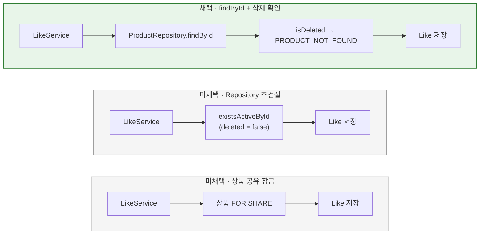

# 좋아요 등록 시 활성 상품 확인

[← 전체 선택 현황](total_trade_off.md)

## 판단할 문제

지금은 `LikeController`가 `existsActiveProduct`(readOnly 트랜잭션 ①)와 `register`(트랜잭션 ②)를 따로 호출한다.
①과 ② 사이에 상품이 삭제되면 삭제된 상품에 좋아요 행이 생긴다.
그래도 내 좋아요 목록은 `deleted = false`로 거르고, 취소도 되므로 실제 피해는 쓰이지 않는 행 하나다.
UseCase를 도입하면서 확인을 어디서, 어떤 방식으로 할지 정해야 한다.

> **채택(구현 후 조정) — Service가 `productRepository.findById` 후 `product.isDeleted()`를 확인해 `PRODUCT_NOT_FOUND`, 같은 트랜잭션, 잠금 없음**
>
> 상품이 없거나 삭제된 상품이면 모두 `ApplicationException(PRODUCT_NOT_FOUND)`를 던지고 404로 응답한다. 응답 본문의 에러 코드는 기존 `LikeController`와 같다.
> 처음에는 `product.ensureActive()`(삭제 시 `DomainException(DELETED_PRODUCT)`)를 채택했다. 그런데 구현해 보니 응답 본문의 에러 코드가 바뀌어, 아래 [구현 후 조정](#구현-후-조정--product_not_found로-되돌리기)에 따라 되돌렸다.
> 대신 EXISTS보다 조금 무거운 PK 조회와 도메인 변환 비용, 잠금이 없어 남는 삭제 경쟁, "삭제 여부" 판단이 `ensureActive`와 Service 두 곳에 생기는 것을 감수한다.

## 흐름 비교

## 장단점 비교

| 기준 | findById + 삭제 확인 (처음엔 ensureActive) | Repository 조건절 (`existsByIdAndDeletedFalse`) | 도메인 `LikePolicy` | `Like.create(userId, product)` | 상품 공유 잠금 |
|---|---|---|---|---|---|
| 비용 | PK 조회 + 도메인 변환 | EXISTS 1회 | PK 조회 + 변환 | PK 조회 + 변환 | 잠금 조회 |
| 규칙 위치 | `Product.ensureActive` 한 곳 | 도메인과 쿼리 두 곳 | 한 곳 (Policy가 위임) | 한 곳 | 한 곳 |
| 새 코드 | 없음 | Repository 메서드 + JPA 메서드 | 한 줄짜리 Policy 클래스 | Like 팩토리 변경 | 잠금 메서드 |
| 컨텍스트 의존 | application이 mall 도메인 사용 (`OrderService` 선례) | 같음 | shopping policy → mall 모델 (`OrderConfirmationPolicy` 선례) | shopping **모델**이 mall 모델에 의존 (선례 없음) | 같음 |
| 삭제 경쟁 | 허용 | 허용 | 허용 | 허용 | 차단, 대신 주문 확정·재고 설정과 경합 |

## 옵션별 판단

> **채택 — findById로 조회 (구현 후 조정):** 사용자 판단이다. 새 Repository 메서드나 클래스 없이 기존 조회를 재사용하고, 비용 차이는 PK 한 행 조회 수준이다. 처음에는 활성 판단도 `ensureActive`에 맡겼지만, 응답 계약을 지키려고 Service에서 `isDeleted()`로 확인하도록 조정했다(아래 절).

> **미채택 — Repository 조건절:** 가장 가볍지만, 사용자가 원하지 않았다. `ProductRepository.existsActive`를 추가하고 구현체에서 `existsByIdAndDeletedFalse`를 쓰는 방식이다. "활성"의 정의가 도메인과 쿼리 두 곳에 생긴다.

> **미채택 — 도메인 `LikePolicy`:** 규칙에 이름이 붙고 단위 테스트가 쉬워지지만, `ensureActive` 한 줄을 감싸는 클래스가 하나 늘어난다.

> **미채택 — `Like.create(userId, product)`:** 기존 코드에서 컨텍스트를 넘는 것은 Policy뿐이고, 모델은 원시값만 받는다(`OrderItem.create`). 이 관례를 깨고 shopping 모델이 mall 모델에 의존하게 된다.

> **미채택 — 상품 공유 잠금:** 쓰이지 않는 행 하나를 막으려고 인기 상품의 좋아요와 주문 확정이 서로 기다리게 만드는 것은 비용이 크다.

## 구현 후 조정 — PRODUCT_NOT_FOUND로 되돌리기

`findById` + `ensureActive`로 구현한 뒤 확인해 보니, 삭제된 상품에 좋아요를 등록할 때 응답이 이렇게 바뀌어 있었다.

| 항목 | 기존 (`LikeController` + JDBC) | `ensureActive` 구현 |
|---|---|---|
| 예외 | `ApplicationException(PRODUCT_NOT_FOUND)` | `DomainException(DELETED_PRODUCT)` |
| HTTP 상태 | 404 | 404 (`ApiErrorMapper`가 `DELETED_PRODUCT`를 404로 변환) |
| 메시지 | 상품을 찾을 수 없습니다. | 상품을 찾을 수 없습니다. |
| 응답 본문 에러 코드 | `PRODUCT_NOT_FOUND` | `DELETED_PRODUCT` |

`LikeApiE2ETest`는 상태 코드만 검사하기 때문에 이 변화를 잡지 못했다.

| 기준 | `DELETED_PRODUCT` 허용 | **`PRODUCT_NOT_FOUND`로 되돌리기** |
|---|---|---|
| API 계약 | 응답 본문 코드가 바뀜. week3-2의 "API 계약 변경 제외"와 충돌 | 기존과 같음 |
| 다른 API와의 일관성 | 주문 생성(`OrderService`)과 같은 코드 | 좋아요 API의 기존 코드 유지. 주문 생성과는 다름 |
| 규칙 위치 | `Product.ensureActive` 한 곳 | 삭제 여부를 Service가 `isDeleted()`로 직접 확인. `ensureActive`와 두 곳 |

> **채택 — `PRODUCT_NOT_FOUND`로 되돌리기:** 사용자 판단이다. 이번 리팩토링은 API 계약을 바꾸지 않는 것이 전제이므로, 클라이언트가 읽는 에러 코드도 유지한다. Service는 `findById(...).filter(product -> !product.isDeleted())`처럼 삭제된 상품을 "없는 상품"과 같이 다루고 `ApplicationException(PRODUCT_NOT_FOUND)`를 던진다. 삭제 여부 판단이 두 곳에 생기는 비용은 감수한다. 삭제된 상품에 대한 응답 코드를 API 전체에서 통일할지는 이번 범위 밖이다.

> **미채택 — `DELETED_PRODUCT` 허용:** 다른 API와 코드는 같아지지만, 계약을 바꾸지 않는다는 전제에 어긋난다.

회귀를 막기 위해 Service 단위 테스트에서 삭제된 상품이면 `PRODUCT_NOT_FOUND`를 던지는지 검증한다. E2E에 코드 문자열 검사를 추가할지는 구현 계획에서 정한다.
