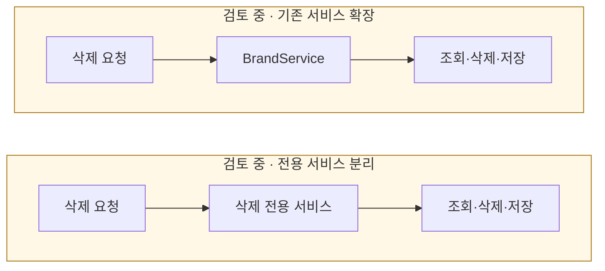

# 일괄 삭제 서비스를 분리할까?

[← 전체 선택 현황](total_trade_off.md)

## 판단할 문제

삭제 정책은 도메인이 수행하고 application은 조회·행동·저장과 트랜잭션을 조율한다.
이를 기존 `BrandService`에 추가할지, 삭제 전용 서비스로 분리할지 비교한다.

> **검토 중 — 아직 채택안 없음**
>
> 전용 서비스 분리를 추천한 의견은 있었지만 사용자와 확정하지 않았다.
> 최소 변경과 책임 분리의 이점·비용을 비교한 뒤 결정한다.

## 흐름 비교

아래는 비교안이다. 두 옵션 모두 같은 트랜잭션 안에서 도메인 삭제와 저장을 수행한다.

## 장단점 비교

| 기준 | 기존 서비스 확장 | 삭제 전용 서비스 |
|---|---|---|
| 변경 규모 | 기존 클래스·구조 유지 | 클래스 추가·기존 역할 조정 |
| 책임 표현 | 생성·수정·삭제가 한 클래스에 모임 | 삭제의 경계와 의존성이 명확함 |
| 유지보수 | 공통 흐름을 한곳에서 관리 가능 | 삭제 흐름·테스트를 분리해 관리 가능 |
| 비용·주의 | 삭제가 커지면 다른 기능과 함께 관리 | 작은 흐름이면 분리 비용이 더 클 수 있음 |

## 옵션별 판단

> **검토 중 — 기존 서비스:** 변경을 최소화할 수 있는 선택이다.

> **검토 중 — 전용 서비스:** 삭제 책임을 분명히 드러내는 방향으로 추천됐지만, 채택으로 간주하지 않는다.

## 남은 사항

서비스 구성과 실제 구현 클래스를 문답으로 결정한다.
어느 쪽이든 프록시를 거치는 application 진입점에 전체 트랜잭션을 두며, 실제 SQL 이후 실패를 유발할 테스트 경계도 후속 계획에서 정한다.
